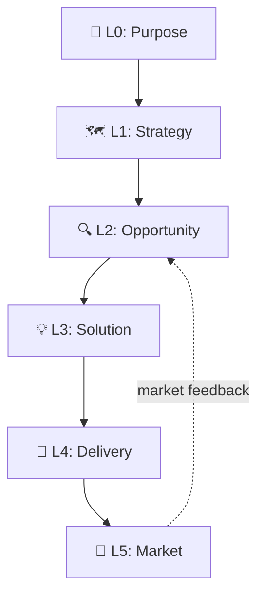

# Mycelium

**Your AI agent should think before it codes.**

AI has made building cheap. It hasn't made *deciding* cheap. Agents will jump from an idea to a pull request without asking why, who for, or whether anyone needs it.

The gap shows up the same way across every AI-native team. You're shipping two products at once: the one customers see, and the internal factory that decides how the first gets made. Most teams build that factory by accident, in chat logs and prompts no one reviews. Mycelium is that factory, made with a strong purpose: build the right thing the right way. Other tools accelerate delivery; Mycelium makes the agent earn the right to start. Built using itself, and released as open source.

```bash
# Recommended: install as a Claude Code plugin
/plugin marketplace add haabe/mycelium
/plugin install mycelium@haabe-mycelium
/mycelium:start       # one command: setup + 10-minute discovery
```

Plugin install is brownfield-safe; no project-root files are modified. Skills are namespaced `/mycelium:<name>`, and `/myc<Tab>` expands the prefix. Legacy install + migration: [`docs/install-paths.md`](docs/install-paths.md).

This README orients you and gets you installed. Full docs live at [`docs/`](docs/README.md): mental model, how-to guides, theory grounding, receipts.

## What it does

You have an idea. You run `/mycelium:start`. The agent doesn't open an editor, it asks you four questions: what's the problem, who has it, what's the biggest risk, what's the smallest next move. Ten minutes in, you have a written brief and the agent points to the riskiest thing you assumed and asks if you want to test it before building anything.

You can say no. A weekend hack gets lighter prompts than a team product, and you can decline depth at any step. What the agent won't do is silently skip past missing evidence and call the work done. It stops where you'd want to be stopped.

## What it feels like

Not a pile of skills dumped on you at once. Three modes that show up at the right time.

You sit down with an idea. As you work through what it actually is, the agent surfaces what you didn't think to ask: "Have you considered who your real user is? Here's what the research says about purpose statements." You weren't going to get there on your own; now you are.

Later, tired enough that the bias check feels optional, the agent stops you: "You're about to skip the bias check. The evidence gate requires this before progressing." It catches the moment you'd most like to slip past.

When the phase closes, you get the picture back: "evidence ✓, bias check ✗, corrections ✓." What's done, what's still owed.

Same agent, three voices. Mentor in the work. Guardrail at the edge. Checklist at the close. A weekend hack sees fewer of these moments; a team product sees them all. The intensity scales with what's at stake, not with how many skills are loaded.

## Who it's for

**Builders.** Solo developers and small teams using AI agents to build products. If you can't afford to burn runway on the wrong thing, Mycelium helps you find the right thing before you build it.

Works for software, online courses, AI tools, and services. One command to start. The agent guides you from there.

If you already do all of this on your own (discovery before delivery, evidence before commitment, your agent not skipping the boring parts under pressure), you don't need Mycelium. If you mean to but the agent does skip them, that's the gap Mycelium fills.

## Who it's not for

Mycelium is for work where deciding what to build is the hard part. Some use cases are better served elsewhere; saying so up front saves frustration.

- **Triage-lane work.** Stale-ticket sweepers, board monitors, fixed-template brief generators. The decision of *what* to do is already made; you need execution velocity, not discovery. Paddo's [boring agents](https://paddo.dev/blog/boring-agents-ship/) patterns fit these directly.
- **Pure execution acceleration in a known scope.** The build is decided; just ship it faster. Tools like [Addy Osmani's agent-skills](https://github.com/addyosmani/agent-skills) optimize this. They compose with Mycelium when discovery is missing, but if discovery is settled, use them directly.
- **Centralized cross-role org workflows.** Mycelium is built for one project, one shared repo, one builder or small team using standard git. PMs, CTOs, developers, and CEOs live-editing the same canvas concurrently is a different architecture: merge semantics on YAML, identity attribution per edit, locks on gate evaluations mid-progress. Not yet built. If you need that shape, Mycelium isn't it.
- **Projects where the ceremony feels heavier than the value it adds.** Mycelium scales gates to project size, but if your project genuinely lacks wrong-build risk, the discipline reads as bureaucracy. That's a fit signal; listen to it.

## How it works

Two building blocks. **Scales** answer *"What am I deciding?"* The levels run from Purpose down to Delivery and Market. **Diamonds** answer *"How do I decide?"* The same Discover → Define → Develop → Deliver cycle runs at every scale.



Not all scales are required. A weekend project might skip L1 entirely. `/mycelium:start` classifies your project and tells you which scales matter; the system scales to your project, not the other way around.

Every diamond transition must pass theory gates: evidence checks grounded in specific frameworks. Not "I'm confident enough", but "here's the evidence". If a gate fails, the agent tells you what's missing, cites the theory, suggests the skill to run, and does not proceed.

All product knowledge lives in `.claude/canvas/*.yml`: structured YAML, committed to git. The canvas IS the spec: the prototype-IS-the-spec discipline from Cagan, applied to product knowledge instead of code.

If delivery reveals a bad assumption, the diamond **regresses** back with new evidence. That's the system working correctly, not failing.

→ Depth: [docs/usage-modes.md](docs/usage-modes.md), [docs/skills/](docs/skills/README.md), [docs/theories.md](docs/theories.md), [docs/philosophy.md](docs/philosophy.md).

## Where it sits in the field

The vocabulary settled in spring 2026. Martin Fowler / Thoughtworks ([Birgitta Böckeler, 2026-04-02](https://martinfowler.com/articles/harness-engineering.html)) and Ning et al. ([arxiv 2605.18747, 2026-05-18](https://arxiv.org/abs/2605.18747)) both name **harness engineering** as an emerging practice: feedforward guides plus feedback sensors, computational and inferential, regulating an agent toward a desired state.

Mycelium is one worked example of this taxonomy, on a markdown + canvas-YAML + validator substrate. The family of mechanisms is consensus-forming; the substrate choice and the specific gating discipline are Mycelium's own design.

## How Mycelium got smarter

Mycelium has been dogfooded on three small projects and tested by outside users under realistic time pressure. Each session taught the framework something different. Most of what they taught is in the version you're looking at right now.

- **[When consistency stopped counting as evidence](docs/receipts/cases/2026-05-09-consistency-as-evidence-graduation.md):** what Mycelium learned to distrust about itself. A pattern recurring across 5 instances graduated to anti-pattern #7 with an ambient self-check. The framework's own verification discipline now flags when its agent argues from internal coherence rather than external evidence.
- **[Edith-Mari's book project](docs/receipts/cases/2026-05-20-edith-mari-book-project.md):** what Mycelium reached beyond developers. First non-developer user (a writer with a cookbook project) hit the brief-synthesis flow at the affective layer and surfaced the wayfinding-at-phase-transitions correction. The framework's plain-language discipline was load-bearing.
- **[The macOS fileviewer that didn't ship](docs/receipts/cases/2026-04-macos-fileviewer.md):** what Mycelium stopped, and what that gave it. The project that didn't ship contributed more than the two that did: 10 framework features came out of a kill.
- **[Alex's first run](docs/receipts/cases/2026-05-26-alex-cohort-first-run.md):** what the deepest single session cost the reader. An outside user's first run surfaced output-density and post-build-silence gaps that drove the v0.31.x batch.
- **[Mycelium running on itself](docs/receipts/cases/2026-05-09-plugin-form-dogfood.md):** what the framework caught about its own ship. The founder's first plugin-form session surfaced 5 bugs that four prior subagent simulations had missed. The graduation lesson (subagent-simulation ≠ lived friction) now anchors the framework's pre-ship audit discipline.

The framework you're looking at now is partly built from things it stopped itself.

→ Full tables, per-mechanism index, per-contributor index: [docs/receipts/](docs/receipts/README.md).
→ The people who shaped these: [CONTRIBUTORS.md](CONTRIBUTORS.md).

## Resuming work

Returning to a project? Run `/mycelium:diamond-assess`. The agent reads your canvas state and tells you where you are and what to do next. Legacy installs run `/diamond-assess`. Install variants, upgrading, and migration paths: [`docs/install-paths.md`](docs/install-paths.md).

## Going deeper

| If you want to... | Go to |
|---|---|
| Build the mental model (how to think in it) | [docs/mental-model.md](docs/mental-model.md) |
| Understand why Mycelium is opinionated | [docs/philosophy.md](docs/philosophy.md) |
| Evaluate it for your team | [docs/evaluate.md](docs/evaluate.md) |
| Look up a specific skill | [docs/skills/](docs/skills/README.md) |
| Check the theory grounding | [docs/theories.md](docs/theories.md) (30+ frameworks) |
| Read the full receipts index | [docs/receipts/](docs/receipts/README.md) |
| Install variants, migration, upgrading | [docs/install-paths.md](docs/install-paths.md) |
| Read the FAQ | [docs/faq.md](docs/faq.md) |
| Vocabulary check | [docs/glossary.md](docs/glossary.md) |
| See version history | [docs/changelog.md](docs/changelog.md) |
| Contribute or get listed | [CONTRIBUTORS.md](CONTRIBUTORS.md) + [docs/contributing/](docs/contributing/README.md) |
| Check regulatory exposure | [docs/regulatory.md](docs/regulatory.md) + [docs/ai-system-card.md](docs/ai-system-card.md) |

## Acknowledgments

Mycelium is shaped by the people who used it and helped sharpen it. Credits: [CONTRIBUTORS.md](CONTRIBUTORS.md). Theory authors are credited in [docs/theories.md](docs/theories.md).

## License

MIT License. See [LICENSE](LICENSE).

---

*Mycelium is not affiliated with any of the authors or publishers referenced. All citations are for educational purposes and to credit the intellectual foundations this system builds upon.*
