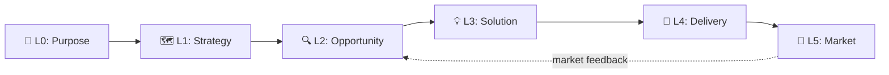

# Mycelium

**Your AI agent should think before it codes.**

AI has made building cheap. It hasn't made *deciding* cheap. Agents will jump from an idea to a pull request without asking why, who for, or whether anyone needs it. Other tools accelerate delivery — Mycelium makes the agent earn the right to start.

```bash
# Recommended (post-v0.20.0): install as a Claude Code plugin
/plugin marketplace add haabe/mycelium
/plugin install mycelium@haabe-mycelium
/mycelium:start       # one command: setup + 10-minute discovery
```

Plugin install is brownfield-safe: no project-root files are modified. Skills are namespaced as `/mycelium:<name>`. See [docs/get-started.md](docs/get-started.md) for details.

**On the namespace prefix.** Anthropic's plugin convention requires `/<plugin>:<skill>`, so every Mycelium skill is `/mycelium:foo`. Two ergonomics that take the typing tax down:

- **Tab completion** — type `/myc<Tab>` in Claude Code and it expands to `/mycelium:`. Then a few letters of the skill name + `<Tab>` finishes it. `/mycelium:diamond-assess` is six keystrokes.
- **Natural-language invocation** — you can also just say "run mycelium setup" or "have mycelium assess where we are." Claude Code routes to the right skill. The `/...` form is faster once you know the name; prose is fine when you don't.

Legacy install (pre-v0.20.0, still supported during transition):
```bash
npx degit haabe/mycelium my-project && cd my-project
# Start Claude Code, then:
/interview
```

## What it is in 5 lines

Build to learn, then build to earn (Patton). 30+ established frameworks, connected by theory gates so critical steps cannot be skipped. The agent does not progress until the evidence says it should. Discovery to market feedback at six scales (Purpose → Strategy → Opportunity → Solution → Delivery → Market), the same four-phase diamond at every scale. Configuration files plus orchestrated prompts — not a software library.

## Who it's for

**Builders** — solo developers or small teams using AI agents to build products. If you can't afford to burn runway on the wrong thing, Mycelium helps you find the right thing before you build it.

Works for **software, online courses, AI tools, and services**. One command to start. The agent guides you from there.

## Who it's not for

Mycelium is for work where deciding *what to build* is the hard part. Some use cases are better served elsewhere — saying so up front saves frustration:

- **Triage-lane work** — stale-ticket sweepers, board monitors, fixed-template brief generators. The decision of *what* to do is already made; you need execution velocity, not discovery. Paddo's [boring agents](https://paddo.dev/blog/boring-agents-ship/) patterns fit these directly.
- **Pure execution acceleration in a known scope** — the build is decided; just ship it faster. Tools like [Addy Osmani's agent-skills](https://github.com/addyosmani/agent-skills) optimize this. They compose with Mycelium when discovery is missing, but if discovery is settled, use them directly.
- **Projects where the ceremony feels heavier than the value it adds.** Mycelium scales gates to project size, but if your project genuinely lacks wrong-build risk, the discipline reads as bureaucracy. That's a fit signal — listen to it.

Time-constrained projects ARE supported as of 2026-04-30: `/interview` Phase 0 picks **<8h inline discovery**, **8-48h sprint mode**, or **48h+ full interview**. The path is selected by your answer to "How much time do you have?"

## What it feels like

Not 49 skills dumped on you at once. Three modes that show up at the right time:

| When | Experience | Example |
|------|-----------|---------|
| **During a phase** | Mentor | "Have you considered who your real user is? Here's what the research says about purpose statements." |
| **At boundaries** | Guardrail | "You're about to skip the bias check. The evidence gate requires this before progressing." |
| **At transitions** | Checklist | "Before moving forward: evidence ✓, bias check ✗, corrections ✓" |

A small project sees fewer gates and lighter guidance. A complex product gets the full treatment.

## How Mycelium got smarter

Mycelium has been dogfooded on three small projects AND tested by one outside user under realistic time pressure. Each session taught the framework something different — and most of what they taught is in the version you're looking at right now.

- **[tic-tac-toe](docs/receipts/cases/2026-04-tic-tac-toe.md)** — what Mycelium learned. One durable engineering pattern (optimistic UI desync) now in project-local memory.
- **[macos-can-i-open](docs/receipts/cases/2026-04-macos-can-i-open.md)** — what Mycelium improved. Two reusable Swift / AX corrections from observed agent failure.
- **[macos-fileviewer](docs/receipts/cases/2026-04-macos-fileviewer.md)** — what Mycelium stopped, and what that gave it. The project that didn't ship contributed more than the two that did: 10 framework features came out of a kill.
- **[drew-hoskins-takehome](docs/receipts/cases/2026-04-30-drew-hoskins-takehome.md)** — what a real outside user under pressure surfaced. 82 prompts, 8 hours, 7 framework changes.
- **[framework-self-correction](docs/receipts/cases/2026-05-01-framework-self-correction.md)** — what the framework caught itself doing. A 4-day cycle that graduated 5 patterns from the framework's own friction log without a new project.

The framework you're looking at now is partly built from things it stopped itself.

→ Full tables, per-mechanism index, per-contributor index: [docs/receipts/](docs/receipts/README.md).
→ The people who shaped these: [CONTRIBUTORS.md](CONTRIBUTORS.md).

## How it works

Two building blocks: **Scales** answer *"What am I deciding?"* (from Purpose down to Delivery and Market). **Diamonds** answer *"How do I decide?"* (the same Discover → Define → Develop → Deliver cycle at every scale).



Not all scales are required. A weekend project might skip L1 entirely. `/interview` classifies your project and tells you which scales matter — the system scales to your project, not the other way around.

Every diamond transition must pass theory gates — evidence checks grounded in specific frameworks. Not "I'm confident enough", but "here's the evidence". If a gate fails, the agent tells you what's missing, cites the theory, suggests the skill to run, and does not proceed.

All product knowledge lives in `.claude/canvas/*.yml` — structured YAML committed to git. The canvas IS the spec (the prototype-IS-the-spec discipline from Cagan applied to product knowledge, not just code).

If delivery reveals a bad assumption, the diamond **regresses** back with new evidence. This is the system working correctly, not failing.

→ Depth: [docs/usage-modes.md](docs/usage-modes.md), [docs/skills/](docs/skills/README.md), [docs/theories.md](docs/theories.md), [docs/philosophy.md](docs/philosophy.md).

## Quick start

### Recommended: plugin install (any project, brownfield-safe)

Inside Claude Code:

```
/plugin marketplace add haabe/mycelium
/plugin install mycelium@haabe-mycelium
/mycelium:start
```

`/mycelium:start` is the recommended first-run command — it composes `/mycelium:setup` (project-state directories under `.claude/`) and `/mycelium:interview` (10-minute discovery on your idea) into one invocation, with a short welcome to bridge the install→value gap. Both sub-skills remain invocable directly if you prefer piecewise. None of the steps touch your project root files (CLAUDE.md, README, LICENSE). Idempotent — re-running on an initialized project routes to `/mycelium:diamond-assess` instead.

Skills are namespaced (`/mycelium:<name>`) per Anthropic's plugin convention. Use `/myc<Tab>` to expand the prefix, or invoke in prose ("run mycelium start", "have mycelium assess current state") — Claude Code routes either form.

### Legacy install (deprecated as of v0.20.x)

The `npx degit haabe/mycelium` install path is **no longer supported** for new installs. As of v0.20.x, framework reference content (skills, hooks, engine, schemas, scripts) lives in the plugin cache, not in the user's project. A fresh `npx degit` would land an empty `.claude/` with no skills to invoke and no hooks to fire.

Existing legacy installs continue to work locally. To migrate to plugin form, see the next subsection. To recover from a broken legacy refresh, see [docs/migration.md#recovering-from-a-broken-legacy-refresh](docs/migration.md#recovering-from-a-broken-legacy-refresh).

The legacy path is scheduled for full removal in v0.21.0 (target: 2026-06-09 or earlier).

### Migrating from legacy to plugin form

If you already installed Mycelium via `npx degit` and want to switch to plugin form, your project state (canvas, diamonds, memory, decision log) is preserved. The agent-driven path:

```
/plugin marketplace add haabe/mycelium
/plugin install mycelium@haabe-mycelium
/mycelium:migrate-from-legacy
```

The skill walks through detection, plugin verification, the explicit "what will and will not change" preview, the migration script, and verification. Migration is reversible via git (`git reset --hard HEAD` before committing).

Or run the script directly: `bash .claude/scripts/upgrade.sh --migrate-to-plugin`. Use `--check-migration` to see which form your project is on without making changes. Full guide: [docs/migration.md](docs/migration.md).

> **Heads-up if your install is older than v0.20.10**: the `--migrate-to-plugin` flag was added in v0.20.10. If your local `.claude/scripts/upgrade.sh` predates it, the script will treat the flag as a version arg and fail with "Failed to pull upstream. Check version/tag exists: --migrate-to-plugin". Fix: run `bash .claude/scripts/upgrade.sh` (no args) once first to refresh your `upgrade.sh` from upstream main, then re-invoke with the flag. Surfaced during the maintainer's own self-migration on 2026-05-09.

### Resuming work

Plugin form: `/mycelium:diamond-assess`. Legacy: `/diamond-assess`. The agent reads your canvas state and tells you where you are and what to do next.

## Upgrading

Mycelium is not a software library — it's instructions that reshape agent behavior. Upgrading replaces framework files while preserving your project state.

**Plugin form** (recommended, post-v0.20.0):
```
/plugin update mycelium@haabe-mycelium
```
Plugin auto-update is on by default for the official-style marketplace; manual update via `/plugin marketplace update haabe-mycelium` followed by `/reload-plugins`.

**Legacy form**:
```bash
bash .claude/scripts/upgrade.sh          # latest
bash .claude/scripts/upgrade.sh v0.12.0  # specific version
```

After upgrading, run `/diamond-assess` to see your work through the new version's lens.

## Going deeper

| If you want to... | Go to |
|---|---|
| Try it on a new project | Quick start above |
| Understand why opinionated | [docs/philosophy.md](docs/philosophy.md) |
| Look up a specific skill | [docs/skills/](docs/skills/README.md) (49 skills) |
| Check the theory grounding | [docs/theories.md](docs/theories.md) (30+ frameworks) |
| Evaluate it for your team | [docs/evaluate.md](docs/evaluate.md) |
| Read the FAQ | [docs/faq.md](docs/faq.md) |
| Vocabulary check | [docs/glossary.md](docs/glossary.md) |
| See version history | [docs/changelog.md](docs/changelog.md) |
| Contribute / get listed | [CONTRIBUTORS.md](CONTRIBUTORS.md) + [docs/contributing/](docs/contributing/README.md) |
| Check regulatory exposure | [docs/regulatory.md](docs/regulatory.md) + [docs/ai-system-card.md](docs/ai-system-card.md) |

## Acknowledgments

Mycelium is shaped by community feedback. See [CONTRIBUTORS.md](CONTRIBUTORS.md) for credits. Theory authors are credited in [docs/theories.md](docs/theories.md).

## License

MIT License. See [LICENSE](LICENSE).

---

*Mycelium is not affiliated with any of the authors or publishers referenced. All citations are for educational purposes and to credit the intellectual foundations this system builds upon.*
