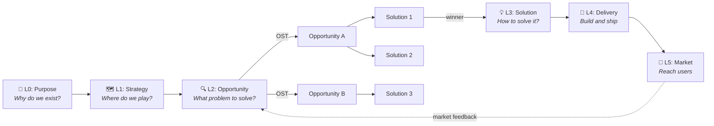
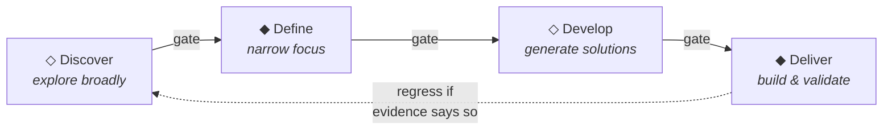
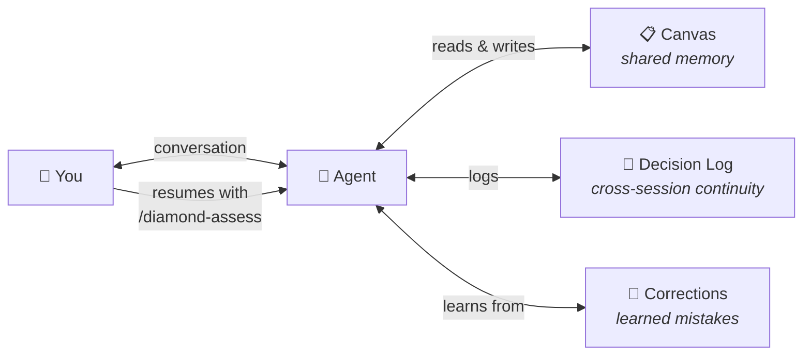
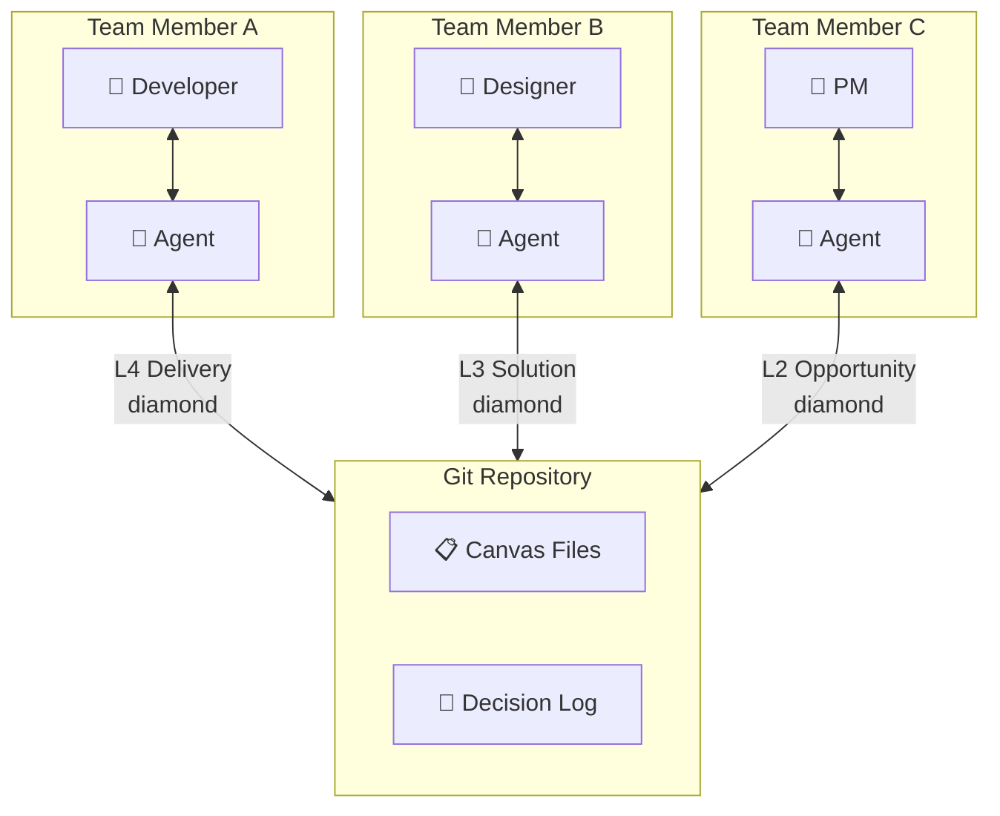
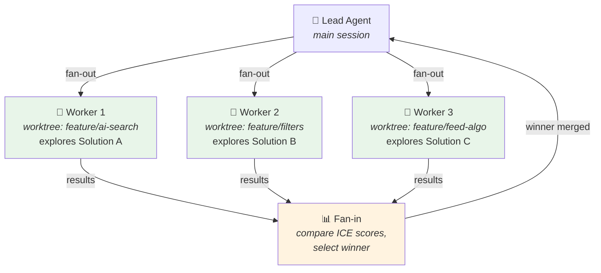

# Mycelium

**Build the right thing the right way.**

AI agents are great at building. They're terrible at knowing *what* to build. They'll jump from an idea to code without discovery, skip security, ignore accessibility, and inflate their own confidence. Spec-driven tools help structure the coding — but they start at "what to build," never "should you build it?"

Mycelium is the only AI harness that guides the full journey from *"should we build this?"* to *"did it work?"* — powered by 30+ established product frameworks, connected by theory gates so critical steps can't be skipped.

```bash
npx degit haabe/mycelium my-project && cd my-project
# Start Claude Code, then:
/interview
```

## Who It's For

**Builders** — solo developers or small teams using AI agents to build products. If you can't afford to burn runway on the wrong thing, Mycelium helps you find the right thing before you build it.

Works for **software, online courses, AI tools, and services**. One command to start. The agent guides you from there.

## What It Feels Like

Mycelium isn't 44 skills dumped on you at once. It's three modes that show up at the right time:

| When | Experience | Example |
|------|-----------|---------|
| **During a phase** | Mentor | "Have you considered who your real user is? Here's what the research says about purpose statements." |
| **At boundaries** | Guardrail | "You're about to skip the bias check. The evidence gate requires this before progressing." |
| **At transitions** | Checklist | "Before moving forward: evidence ✓, bias check ✗, corrections ✓" |

You're in control. The agent surfaces what matters, catches you when you drift, and confirms readiness when you're done. A small project sees fewer gates and lighter guidance. A complex product gets the full treatment. The process is proportionate to the stakes.

## How Mycelium Got Smarter

Mycelium has been dogfooded on three small projects. Each one taught the framework something different — and most of what they taught is in the version you're looking at right now.

### tic-tac-toe — *what we learned*
[huggingface.co/spaces/haabe/tic-tac-toe](https://huggingface.co/spaces/haabe/tic-tac-toe). React + TypeScript + Node.js WebSocket on Hugging Face Spaces, 40 Vitest tests, WCAG 2.1 AA accessible. Zero human-written lines of code. The agent + early Mycelium carried it end-to-end. One durable engineering pattern came out (optimistic UI in client-server real-time apps) and now lives in that project's `corrections.md` so the agent won't ship the same desync bug twice.

### macos-can-i-open — *what we improved*
A native macOS app for bulk file type association management (Swift/SwiftUI, LaunchServices, AXUIElement). The session produced two reusable corrections worth keeping: SwiftUI Table cells lose `@EnvironmentObject` on scroll (use concrete values instead), and `AXIsProcessTrusted()` lies for ad-hoc signed apps (test with a real AX call instead). Both are now project-memory entries the agent will respect on the next macOS project.

### macos-fileviewer — *what we stopped, and what that gave us*
A planned macOS file viewer that **never wrote a line of code**. Killed in L0 Discovery after a mocked-persona exercise: 4 of 6 personas would not switch defaults, including the modal user. Mycelium correctly forced the stop — and the session produced a 12-finding dogfood report. Most of those findings are now shipped framework features:

| What the kill found | What now exists in Mycelium |
|---|---|
| No discipline for mocked personas | `/mocked-persona-interview` skill |
| No "I'm dogfooding the framework" project mode | `meta_dogfood` project type, `dogfood: true` canvas flag |
| Two memory systems undocumented and overlapping | Memory boundary section in `CLAUDE.md` |
| Reflexion hook fired on agent-internal failures | Hook scoped to project-relevant failures only |
| No sanctioned exit from a stuck diamond | `/diamond-progress pivot/park/kill` subcommands |
| Strategic loop checks easy to ignore | `/feedback-review` skill |
| No quarterly framework self-assessment | `/framework-health` skill |
| Canvas drifts toward confident-sounding speculation | `/canvas-health` lints provenance and staleness |
| No mechanism for the framework to learn from its cycles | `cycle-history.yml` + adaptive thresholds + framework-reflexion |
| No accumulator for dogfood findings | `.claude/evals/dogfood-reports/` directory |

This is what *"Mycelium gets smarter with each project cycle"* actually looks like. Not a promise — receipts. The project that didn't ship contributed more to the framework than the two that did.

## How It Works

### The Flow

Mycelium has two building blocks that work together:

- **Scales** answer *"What am I deciding?"* — from the big picture down to details
- **Diamonds** answer *"How do I decide?"* — the same four-phase cycle at every scale

#### The Journey: Scales × Diamonds



#### Every Scale Runs the Same Diamond



**Scales** flow top-to-bottom. Each scale spawns the next when it's ready:

| Scale | Question | Key Theories |
|-------|----------|-------------|
| L0: Purpose | "Why do we exist?" | Sinek, Christensen |
| L1: Strategy | "Where do we play?" | Wardley, North Star, Skelton |
| L2: Opportunity | "What problem to solve?" | Torres, Allen, Hoskins, Cynefin |
| L3: Solution | "How to solve it?" | Gilad, Cagan, Downe |
| L4: Delivery | "Build and ship" | Forsgren, OWASP Top 10:2025, SOLID |
| L5: Market | "Reach users" | Lauchengco, Shotton |

**Not all scales are required.** A weekend project might skip L1 Strategy entirely. A small bet might start at L2 Opportunity and go straight to L4 Delivery. `/interview` classifies your project and tells you which scales matter — the system scales to your project, not the other way around.

**Diamonds** run at every scale — the same four phases: **Discover** (explore broadly) → **Define** (narrow focus) → **Develop** (generate solutions) → **Deliver** (build & validate). Each transition must pass theory gates.

**The OST bridge**: At L2, discovery produces an Opportunity Solution Tree (Torres). Multiple opportunities are found, multiple solutions are generated for each. Solutions compete — the winner spawns an L3 Solution diamond. Losers are archived with evidence, not deleted.

**Scenarios as connective tissue**: Scenarios (Hoskins) carry user context from L2 through L5. Born from interview stories at L2 (persona + means + motive + simulation), solutions are designed against them at L3, tested against them at L4, and validated in reality at L5. They're the thread that keeps every phase grounded in a real person's real situation.

**The feedback loop**: After L5 Market, real-world signals feed back into new L2 Opportunity diamonds. Purpose → Strategy → Discovery → Solution → Delivery → Market → Discovery. The cycle never truly ends.

If delivery reveals a bad assumption, the diamond **regresses** back with new evidence. This is the system working correctly, not failing.

### Theory Gates

Every diamond transition must pass theory gates — evidence checks grounded in specific frameworks. Not "I'm confident enough," but "here's the evidence":

| Gate | In Plain English | Suggested Skill |
|------|-----------------|----------------|
| Evidence | Do you have real data, not just assumptions? | `/user-interview`, `/assumption-test`, `/metrics-pull` |
| Four Risks | Is it valuable, usable, buildable, and viable? | `/assumption-test` |
| Jobs to be Done | Do you understand what users actually need — practically, emotionally, socially? | `/jtbd-map` |
| Domain Fit | Is your approach appropriate for the type of problem? | `/cynefin-classify` |
| Bias | Are you seeing clearly, or fooling yourself? | `/bias-check` |
| Security | Could this be attacked? Have you checked? | `/threat-model`, `/security-review` |
| Privacy | Are you collecting only what you need and respecting user rights? | `/privacy-check` |
| Outcomes | Is the result better, more valuable, faster, safer, and sustainable? | `/bvssh-check` |
| Service Quality | Does it work well as a service? Is it accessible? | `/service-check`, `/a11y-check` |
| Delivery Health | Are you shipping at a healthy pace? | `/dora-check` |
| Learning | Have you checked what went wrong last time? | `/preflight`, `/reflexion` |
| Regulatory | Does this need to comply with AI regulation? | `/regulatory-review` |

Not all gates apply at every scale. L0 Purpose checks 5 gates. L4 Delivery checks 11. The system tells you which ones matter right now. You don't need to know the underlying frameworks — the agent explains each gate when it's relevant.

If a gate fails, the agent tells you what's missing, cites the theory, suggests the skill to run — and does not proceed.

### The Canvas

All product knowledge lives in `.claude/canvas/*.yml` — structured YAML files committed to git. They're your single source of truth and your product documentation:

| Canvas | What It Captures | Theory |
|--------|-----------------|--------|
| `purpose.yml` | Why/How/What, who it's for | Sinek |
| `north-star.yml` | Key metric + input metrics | North Star |
| `jobs-to-be-done.yml` | User jobs (functional/emotional/social) | Christensen |
| `landscape.yml` | Strategic landscape, competitors | Wardley |
| `opportunities.yml` | Opportunity Solution Tree | Torres |
| `scenarios.yml` | User scenarios (persona/means/motive/simulation) | Hoskins |
| `gist.yml` | Goals, Ideas, Steps, Tasks | Gilad |
| `services.yml` | 15 service quality principles | Downe |
| `threat-model.yml` | STRIDE threat model | OWASP |
| `dora-metrics.yml` | Delivery performance | Forsgren |
| `go-to-market.yml` | Positioning, launch tiers | Lauchengco |
| ... | 13 more canvas files | Various |

Not all canvas files are needed for every project. `/interview` classifies your project and tells you which ones to focus on.

### Self-Learning

Mycelium gets smarter with each project cycle:

- **Corrections** — learns from mistakes so they're not repeated
- **Patterns** — captures what worked for reuse
- **Adaptive thresholds** — calibrates confidence scoring from historical data
- **Reflexion loops** — implement, validate, self-critique, retry
- **Evidence decay** — flags stale evidence so decisions stay current

### Harnessing (What Prevents the Agent from Going Haywire)

Three enforcement tiers, 33 constraints, [phase-scoped](/.claude/harness/guardrails.md) to manage instruction budget:

- **BLOCK** (2): Mechanically prevented. Secrets in code, stale corrections.
- **REVIEW** (15): Gates delivery completion. Tests, accessibility, security, BVSSH, decision logging, AI disclosure.
- **NUDGE** (16): Surfaced by hooks, not blocking. Engineering principles, bias checks, devil's advocate, data minimization.

Plus 5 hook layers that fire automatically — from secret detection before code edits (~30 tokens) to theory gate evaluation on demand. Total overhead: ~6,000 tokens/session.

## Quick Start

### New Project

Click **"Use this template"** on GitHub, or:

```bash
npx degit haabe/mycelium my-project
cd my-project
```

Then start Claude Code and run `/interview`. The agent guides you through purpose, vision, users, and classifies your project.

### Existing Project

```bash
npx degit haabe/mycelium/CLAUDE.md ./CLAUDE.md
npx degit haabe/mycelium/.claude ./.claude
```

Then start Claude Code and run `/interview`.

### Resuming Work

```
/diamond-assess
```

The agent reads your canvas state and tells you where you are and what to do next.

## Upgrading

Mycelium is not a software library — it's instructions that reshape agent behavior. Upgrading replaces framework files while preserving your project state (canvas, diamonds, decisions, memory).

```bash
bash .claude/scripts/upgrade.sh          # latest
bash .claude/scripts/upgrade.sh v0.12.0  # specific version
```

After upgrading, run `/diamond-assess` to see your work through the new version's lens.

## Skills Reference (44 skills)

### Onboarding & Assessment
| Skill | When to Use |
|-------|------------|
| `/interview` | Onboarding: purpose, vision, North Star, project classification |
| `/diamond-assess` | Current state, recommended next action |
| `/diamond-progress` | Move diamond forward with theory gates |

### Discovery
| Skill | When to Use |
|-------|------------|
| `/user-interview` | Story-based interviews with bias mitigation |
| `/mocked-persona-interview` | Disciplined mocked personas (speculation-tagged) |
| `/user-needs-map` | Map needs independently of solutions |
| `/ost-builder` | Build Opportunity Solution Tree from research |
| `/jtbd-map` | Jobs to be Done mapping |
| `/assumption-test` | Design smallest viable test for an assumption |
| `/cynefin-classify` | Classify problem domain |
| `/wardley-map` | Strategic landscape mapping |
| `/ice-score` | ICE scoring with evidence-backed confidence |
| `/gist-plan` | GIST planning: goals, ideas, steps, tasks |
| `/handoff` | Structured handoff for offline human tasks |
| `/log-evidence` | Record findings from completed conversations |

### Quality & Governance
| Skill | When to Use |
|-------|------------|
| `/bias-check` | Review cognitive biases before research/decisions |
| `/devils-advocate` | Challenge assumptions before major decisions |
| `/bvssh-check` | Holistic BVSSH health evaluation |
| `/service-check` | Downe's 15 service principles |
| `/threat-model` | STRIDE threat modeling |
| `/privacy-check` | Privacy by Design / GDPR assessment |
| `/security-review` | OWASP secure design review |
| `/usability-check` | Nielsen's 10 usability heuristics |
| `/a11y-check` | Accessibility audit (WCAG 2.1 AA) |
| `/regulatory-review` | EU AI Act risk classification |

### Delivery
| Skill | When to Use |
|-------|------------|
| `/delivery-bootstrap` | Auto-detect tech stack, set up tooling |
| `/preflight` | Pre-code validation checklist |
| `/reflexion` | Self-correcting implementation loop |
| `/definition-of-done` | Verify all DoD criteria |
| `/dora-check` | Delivery performance metrics |
| `/retrospective` | Post-delivery learning capture |

### Evidence & Metrics
| Skill | When to Use |
|-------|------------|
| `/metrics-detect` | Detect external metric sources (GitHub, analytics, payments, reviews) and configure adapters |
| `/metrics-pull` | Pull snapshots from all configured sources, compute deltas, draft canvas evidence entries |

### Market & Organization
| Skill | When to Use |
|-------|------------|
| `/launch-tier` | Classify releases, plan go-to-market |
| `/team-shape` | Team Topologies assessment |

### Canvas & Orchestration
| Skill | When to Use |
|-------|------------|
| `/canvas-update` | Update canvas with new evidence |
| `/canvas-health` | Lint canvas for staleness, missing fields |
| `/canvas-sync` | Synchronize canvas across team via git |
| `/fan-out` | Parallel agent orchestration |

### Self-Improvement
| Skill | When to Use |
|-------|------------|
| `/feedback-review` | Aggregate feedback signals, check health |
| `/eval-runner` | Run benchmark scenarios |
| `/corrections-audit` | Analyze correction trends |
| `/prompt-optimizer` | A/B test instruction changes |

## Usage Modes

### Solo Developer

One builder, one agent, one canvas. The agent is your product thinking partner — it remembers context between sessions so you don't have to.



### Team

Canvas files are committed to git — they become shared product documentation. Any team member's agent reads the same state. Different members can work on different diamonds simultaneously.



Canvas updates are PR-reviewed like code changes. Everyone sees the same product state.

### Agent Orchestration

When the OST has multiple solutions to explore in parallel, Mycelium fans out worker agents — each in an isolated git worktree. The lead agent coordinates, compares results, and selects the winner.



Workers get read-only canvas access and worktree isolation. Only the lead agent updates canvas and progresses diamonds. Use `/fan-out` to start parallel exploration.

## JiT Tooling (Language-Agnostic)

Mycelium works with any tech stack. When delivery begins, it auto-detects languages, frameworks, and existing tooling, then generates stack-appropriate validation. Universal principles (DRY, KISS, OWASP) apply to all stacks.

The same pattern applies to **metric sources**. `/metrics-detect` scans for signals (git remote, SDK installs, env vars) and asks about channels the repo can't reveal (deployed URL, payment processor, app stores), then generates adapters for sources it hasn't seen before. `/metrics-pull` then turns "I checked the dashboard" into timestamped, sourced, diffable evidence for L0/L1/L2/L5 diamonds.

## Theories & Frameworks Integrated

| Theory | Author(s) | Applied To |
|--------|-----------|------------|
| Golden Circle | Sinek | Purpose, mission, values |
| Jobs to be Done | Christensen, Ulwick | Functional/emotional/social needs |
| Wardley Mapping | Wardley | Strategic landscape, evolution |
| North Star Framework | Ellis | Key metric + input metrics |
| Team Topologies | Skelton, Pais | Team structure, cognitive load |
| Continuous Discovery / OST | Torres | Opportunity discovery, testing |
| User Needs Mapping | Allen | Needs independent of solutions |
| Cynefin Framework | Snowden | Domain classification |
| GIST Planning | Gilad | Evidence-guided prioritization |
| ICE Scoring | Ellis | Impact/Confidence/Ease prioritization |
| Inspired / Empowered | Cagan | Four risks, empowered teams |
| Good Services | Downe | Service design quality |
| Accelerate / DORA | Forsgren, Humble, Kim | Delivery performance (5 metrics incl. FDRT, Reliability) |
| OWASP Top 10:2025 / STRIDE | OWASP, Shostack | Security throughout lifecycle |
| Privacy by Design | Cavoukian | Privacy as default |
| Loved | Lauchengco | Positioning, go-to-market |
| BVSSH | Smart | Holistic outcome measurement |
| Double Diamond | Design Council (2004) | Diverge/converge at every scale |
| Behavioral Science | Shotton, Kahneman | Bias mitigation, ethical design |
| Theory of Constraints | Goldratt | Bottleneck resolution |
| Three Ways / Five Ideals | Kim | DevOps flow, feedback, continual learning |
| CALMS | Willis, Humble | DevOps culture assessment |
| The Fifth Discipline | Senge | Systems thinking archetypes |
| Domain-Driven Design | Evans | Bounded contexts, context mapping |
| Scenarios | Hoskins | User scenarios as connective primitive (L2→L5) |
| Lean UX | Gothelf, Seiden | Hypothesis-driven design |
| Toyota Kata | Rother | Coaching questions for scientific thinking |
| Hooked / Indistractable | Eyal | Ethical engagement design |
| Clean Architecture / SOLID | Martin | Software design principles |
| SRE | Beyer, Jones, Petoff, Murphy | Error budgets, toil, SLIs/SLOs |
| TPS / Lean | Ohno, Toyoda | 7 Wastes, continuous improvement |
| ... and more | | See CLAUDE.md for complete list |

## Regulatory Awareness: EU AI Act

**Mycelium itself is not regulated** — it's configuration files, not an AI system. But products built with Mycelium may be. Mycelium includes a Regulatory Gate at L3 that prompts you to assess risk classification. See `.claude/harness/security-trust.md` for details.

**Mycelium does not certify compliance. For compliance decisions, consult qualified EU AI law counsel.**

## Acknowledgments

Mycelium is shaped by community feedback. See [CONTRIBUTORS.md](CONTRIBUTORS.md) for credits.

## Contributing

Contributions welcome. If you see a gap in the frameworks, a missing bias, or a better way to harness agent behavior, open an issue or PR.

```bash
bash .claude/tests/validate-template.sh  # structural integrity check
```

## License

MIT License. See [LICENSE](LICENSE).

---

*Mycelium is not affiliated with any of the authors or publishers referenced. All citations are for educational purposes and to credit the intellectual foundations this system builds upon.*
