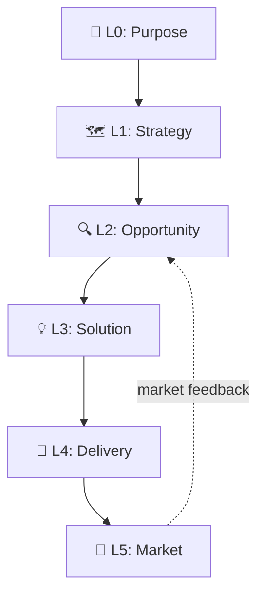

# Mycelium

**Your AI agent should think before it codes.**

AI has made building cheap. It hasn't made *deciding* cheap. Agents will jump from an idea to a pull request without asking why, who for, or whether anyone needs it.

The gap shows up the same way across every AI-native team. The agent is fast, confident, and glad to build something nobody asked for. What it skips is the deciding: why, who for, whether anyone needs it. Mycelium puts that part back. It doesn't replace your judgment; it gives the agent enough feedback that the judgment that ships is still yours. Other tools accelerate delivery; Mycelium makes the agent earn the right to start. Built using itself, and released as open source.

```bash
# Recommended: install as a Claude Code plugin
/plugin marketplace add haabe/mycelium
/plugin install mycelium@haabe-mycelium
/mycelium:start       # one command: setup + 10-minute discovery
```

Plugin install is brownfield-safe; no project-root files are modified. Skills are namespaced `/mycelium:<name>`, and `/myc<Tab>` expands the prefix. Legacy install + migration: [`docs/install-paths.md`](docs/install-paths.md).

This README orients you and gets you installed. Full docs live at [`docs/`](docs/README.md): mental model, how-to guides, theory grounding, receipts.

## What it does

You have an idea. You run `/mycelium:start`. The agent doesn't open an editor; it asks four questions. What's the problem, who has it, what's the riskiest thing you're assuming, and what's the smallest move that would test it. Ten minutes in, you have a written brief and the agent points to the riskiest thing you assumed and asks if you want to test it before building anything.

You can say no. A weekend hack gets lighter prompts than a team product, and you can decline depth at any step. What the agent won't do is silently skip past missing evidence and call the work done. It stops where you'd want to be stopped.

## What it feels like

Three moments you'll recognize.

**The weekend build.** Saturday, an idea, an agent ready to type. The usual ending: a working thing by Sunday that you're not sure anyone needs, yourself included. With Mycelium the first ten minutes go to the questions you'd skip on your own: who it's for, the riskiest thing you're assuming, the smallest way to check. You still ship this weekend. You just ship the version worth shipping.

**The decision that went stale.** Your team agreed on a feature three weeks ago; the agent's been building it ever since. Nobody's re-checked the assumption underneath it. At the close, Mycelium won't sign the work off on "we already decided." It asks what evidence says the assumption still holds, and the stale one surfaces now instead of at launch.

**The tired Friday.** It's late, you're done, and the careful step feels optional. The agent stops you: "you're about to skip the check that catches the thing you'd regret." It catches you exactly when you'd most like to slip past. Then it hands you the honest picture at the close: what's done, what's still owed.

A weekend hack meets fewer of these moments; a team product meets them all. The intensity scales with what's at stake, not with how much you have to learn.

## Why this exists

Skipping discovery is an old habit. You've watched a stakeholder pick a framework because they sat in a workshop with its authors, not because a user asked for it. You've heard "my gut beats the data." You've heard "no point in discovery, users never know what they want anyway." Deciding what is worth building was always the hard part, and there was always a reason to skip it.

The agent just made skipping it free. It runs from idea to pull request without asking why, who for, or whether anyone needs it, faster than any of them ever could. Mycelium answers the old excuses the same way every time: with evidence instead of a shrug.

## Who it's for

**Builders.** Solo developers and small teams using AI agents to build products. If you can't afford to burn runway on the wrong thing, Mycelium helps you find the right thing before you build it.

Works for software, online courses, AI tools, and services. One command to start. The agent guides you from there.

If you already do all of this on your own (discovery before delivery, evidence before commitment, your agent not skipping the boring parts under pressure), you don't need Mycelium. If you mean to but the agent does skip them, that's the gap Mycelium fills.

## Who it's not for

Mycelium is for work where deciding what to build is the hard part. Some use cases are better served elsewhere; saying so up front saves frustration.

- **Triage-lane work.** Stale-ticket sweepers, board monitors, fixed-template brief generators. The decision of *what* to do is already made; you need execution velocity, not discovery. Paddo's [boring agents](https://paddo.dev/blog/boring-agents-ship/) patterns fit these directly.
- **Pure execution acceleration in a known scope.** The build is decided; just ship it faster. Tools like [Addy Osmani's agent-skills](https://github.com/addyosmani/agent-skills) optimize this. They compose with Mycelium when discovery is missing, but if discovery is settled, use them directly.
- **Centralized cross-role org workflows.** Mycelium is built for one project, one shared repo, one builder or small team using standard git. PMs, CTOs, developers, and CEOs live-editing the same canvas concurrently is a different architecture: merge semantics on YAML, identity attribution per edit, locks on gate evaluations mid-progress. Not yet built. If you need that shape, Mycelium isn't it.
- **Projects where the ceremony feels heavier than the value it adds.** Mycelium scales gates to project size, but if your project genuinely lacks wrong-build risk, the discipline reads as bureaucracy. That's a fit signal; listen to it.

## How it works

Two pieces. **Scales** are what you're deciding, from Purpose at the top down to Delivery and Market. **Diamonds** are how you decide: the same Discover, Define, Develop, Deliver loop, run at whatever scale you're working on.



You don't run all of them. A weekend project might skip strategy entirely. `/mycelium:start` reads your project and tells you which scales matter; it sizes itself to the work, not the other way around.

Each step has to clear an evidence check before it continues. Not "I'm confident enough," but "here's what backs it." If a step can't clear, the agent tells you what's missing and which command closes the gap, then stops there.

Your product decisions live as plain YAML in your repo, versioned in git. That's the spec. If the build turns up a bad assumption, the work moves back a step with what you learned, which is the system working, not failing.

→ Depth: [docs/usage-modes.md](docs/usage-modes.md), [docs/skills/](docs/skills/README.md), [docs/theories.md](docs/theories.md), [docs/philosophy.md](docs/philosophy.md).

## Where it sits in the field

Mycelium is one worked example of a pattern the field is converging on: guardrails going in, checks coming back, keeping an agent honest. Others have started naming it too ([Thoughtworks](https://martinfowler.com/articles/harness-engineering.html), [recent research](https://arxiv.org/abs/2605.18747)). Mycelium is one take on it, built on plain files in git.

## How Mycelium got smarter

Mycelium has been dogfooded on three small projects and tested by outside users under realistic time pressure. Each session taught the framework something different. Most of what they taught is in the version you're looking at right now.

- **[When consistency stopped counting as evidence](docs/receipts/cases/2026-05-09-consistency-as-evidence-graduation.md):** what Mycelium learned to distrust about itself. A pattern recurring across 5 instances became a standing self-check the framework runs on itself. The framework's own verification discipline now flags when its agent argues from internal coherence rather than external evidence.
- **[Edith-Mari's book project](docs/receipts/cases/2026-05-20-edith-mari-book-project.md):** what Mycelium reached beyond developers. First non-developer user (a writer with a cookbook project) hit the brief-synthesis flow at the affective layer and surfaced the wayfinding-at-phase-transitions correction. The framework's plain-language discipline was load-bearing.
- **[When the report you cite fact-checks you](docs/receipts/cases/2026-06-07-faros-whiplash-integration.md):** what Mycelium learned about its own observability layer. Faros's *Acceleration Whiplash* and Datadog's *State of AI Engineering* arrived as external prompts; the framework's L5 score landed at 3/5 — strong scaffolding, weak instrumentation. Three changes shipped in one cycle, including the discipline that a schema field becomes a target the moment it's named.
- **[Alex's first run](docs/receipts/cases/2026-05-26-alex-cohort-first-run.md):** what the deepest single session cost the reader. An outside user's first run surfaced output-density and post-build-silence gaps that drove the v0.31.x batch.
- **[When the checker passed and the paths were still dead](docs/receipts/cases/2026-06-18-legacy-path-rot-guard.md):** what Mycelium learned about the limits of its own checks. A dead-link sweep went green; two days later a house-cleaning found migration debt sitting in code-spans and prose, where a link checker scoped to links by design was never going to look. The green audit had been read as a clean bill of health, and a second guard now covers the class the first one couldn't see.

The framework you're looking at now is partly built from things it stopped itself.

→ Full tables, per-mechanism index, per-contributor index: [docs/receipts/](docs/receipts/README.md).
→ The people who shaped these: [CONTRIBUTORS.md](CONTRIBUTORS.md).

## Resuming work

Returning to a project? Run `/mycelium:diamond-assess`. The agent reads your canvas state and tells you where you are and what to do next. Legacy installs run `/diamond-assess`. Install variants, upgrading, and migration paths: [`docs/install-paths.md`](docs/install-paths.md).

## Going deeper

| If you want to... | Go to |
|---|---|
| Build the mental model (how to think in it) | [docs/mental-model.md](docs/mental-model.md) |
| Understand why Mycelium is opinionated | [docs/philosophy.md](docs/philosophy.md) |
| Evaluate it for your team | [docs/evaluate.md](docs/evaluate.md) |
| Look up a specific skill | [docs/skills/](docs/skills/README.md) |
| Check the theory grounding | [docs/theories.md](docs/theories.md) (30+ frameworks) |
| Read the full receipts index | [docs/receipts/](docs/receipts/README.md) |
| Install variants, migration, upgrading | [docs/install-paths.md](docs/install-paths.md) |
| Read the FAQ | [docs/faq.md](docs/faq.md) |
| Vocabulary check | [docs/glossary.md](docs/glossary.md) |
| See version history | [docs/changelog.md](docs/changelog.md) |
| Contribute or get listed | [CONTRIBUTORS.md](CONTRIBUTORS.md) + [docs/contributing/](docs/contributing/README.md) |
| Check regulatory exposure | [docs/regulatory.md](docs/regulatory.md) + [docs/ai-system-card.md](docs/ai-system-card.md) |

## Acknowledgments

Mycelium is shaped by the people who used it and helped sharpen it. Credits: [CONTRIBUTORS.md](CONTRIBUTORS.md). Theory authors are credited in [docs/theories.md](docs/theories.md).

## License

MIT License. See [LICENSE](LICENSE).

---

*Mycelium is not affiliated with any of the authors or publishers referenced. All citations are for educational purposes and to credit the intellectual foundations this system builds upon.*
