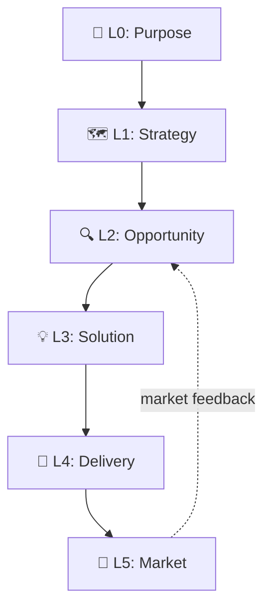

# Mycelium

**Your AI agent should think before it codes.**

Building got cheap. Deciding what to build didn't, and an agent will go from an idea to a pull request without asking why, who for, or whether anyone needs it.

The gap has the same shape every time I see it: the agent is fast and glad to build something nobody asked for. Mycelium puts the deciding back. It gives the agent enough feedback that the judgment that ships is still yours.

Built using itself, and released as open source. That includes [the project it talked me out of](docs/receipts/cases/2026-04-macos-fileviewer.md).

**Prerequisite:** Claude Code, signed in — or another supported agent (see [install paths](docs/install-paths.md)). Then, inside Claude Code:

```
/plugin marketplace add haabe/mycelium
/plugin install mycelium@haabe-mycelium
/mycelium:start       # one command: setup + 10-minute discovery
```

Plugin install is brownfield-safe; no project-root files are modified. Skills are namespaced `/mycelium:<name>`, and `/myc<Tab>` expands the prefix. Legacy install + migration: [`docs/install-paths.md`](docs/install-paths.md).

This README orients you and gets you installed. Full docs live at [`docs/`](docs/README.md): mental model, how-to guides, theory grounding, receipts.

## What it does

You have an idea. You run `/mycelium:start`. The agent asks four questions before it opens an editor. What's the problem, who has it, what's the riskiest thing you're assuming, and what's the smallest move that would test it. Ten minutes in, you have a written brief and the agent points to the riskiest thing you assumed and asks if you want to test it before building anything.

You can say no. A weekend hack gets lighter prompts than a team product, and you can decline depth at any step. It won't skip past missing evidence and call the work done.

## What it feels like

Saturday, an idea, an agent ready to type. The usual ending is a working thing by Sunday that you're not sure anyone needs, yourself included. Mycelium spends the first ten minutes on the questions you'd skip on your own. Who is this for, and what would have to be true for it to work. You still ship this weekend.

Others show up later. A feature the team agreed on three weeks ago and the agent has been building ever since, nobody having re-checked the assumption underneath it. A Friday night where you're done and the careful step feels optional. Both times the move is the same. "We already decided" doesn't count as evidence, and the check lands at the point you'd have gone past it.

The last one is quieter. It's out. A few stars, nobody has opened an issue in a week. So you build the next feature, and you know it's a good one because you wanted it yourself. That's a real reason, half of what you use got built that way. Mycelium writes down which it was. That's all it does with it, and next time you wonder why nobody came, the note is there.

How many of these you meet depends on what's at stake.

## Why this exists

I've worked with digital products since 1997, and most of that time I watched teams skip the deciding part. Not deliberately, and not because anyone thought discovery didn't matter. There was always a reason. End of season, a customer phone call, the C-level with a gut feeling.

The agent just made skipping it free. It goes from an idea to a pull request faster than any of those reasons ever could, and it never stops to ask who the thing is for.

## Who it's for

**Builders.** Solo developers and small teams using AI agents to build products. If you can't afford to burn runway on the wrong thing, Mycelium helps you find the right thing before you build it.

Works for software, online courses, AI tools, and services. One command to start. The agent guides you from there.

If you already do all of this on your own (discovery before delivery, and your agent not skipping the boring parts under pressure), you don't need Mycelium.

## Who it's not for

Mycelium is for work where deciding what to build is the hard part. Some use cases are better served elsewhere; saying so up front saves frustration.

- **Triage-lane work.** Stale-ticket sweepers, board monitors, fixed-template brief generators. The decision of *what* to do is already made, and what you need is execution velocity. Paddo's [boring agents](https://paddo.dev/blog/boring-agents-ship/) patterns fit these directly.
- **Pure execution acceleration in a known scope.** The build is decided; just ship it faster. Tools like [Addy Osmani's agent-skills](https://github.com/addyosmani/agent-skills) optimize this. They compose with Mycelium when discovery is missing, but if discovery is settled, use them directly.
- **Several people editing the same canvas at once.** Mycelium is built for one project, one shared repo, one builder or a small team using standard git. A whole department working the same files at the same time is a different architecture: merge semantics on YAML, identity attribution per edit, locks on gate evaluations mid-progress. Not yet built. If you need that shape, Mycelium isn't it.
- **Projects where the ceremony feels heavier than the value it adds.** Mycelium scales gates to project size, but if your project genuinely lacks wrong-build risk, the discipline reads as bureaucracy.

## How it works

Two pieces. **Scales** are what you're deciding, from Purpose at the top down to Delivery and Market. **Diamonds** are how you decide: the same Discover, Define, Develop, Deliver loop, run at whatever scale you're working on.


```mermaid
graph TD
    L0["🎯 L0: Purpose"]
    L1["🗺️ L1: Strategy"]
    L2["🔍 L2: Opportunity"]
    L3["💡 L3: Solution"]
    L4["🔨 L4: Delivery"]
    L5["🚀 L5: Market"]
    L0 --> L1 --> L2 --> L3 --> L4 --> L5
    L5 -.->|"market feedback"| L2
```

You don't run all of them. A weekend project might skip strategy entirely. `/mycelium:start` reads your project and tells you which scales matter.

Each step has to clear an evidence check before it continues. The check asks what the claim rests on and where that came from. If a step can't clear, the agent tells you what's missing and which command closes the gap, then stops there.

Your product decisions live as plain YAML in your repo, versioned in git. That's the spec. If the build turns up a bad assumption, the work moves back a step with what you learned.

Setup creates six directories and writes nothing outside them:

```
.claude/canvas/       purpose, opportunities, jobs-to-be-done, and the rest
.claude/diamonds/     active.yml, what you're deciding and how far it's got
.claude/harness/      decision-log.md, what you chose and what you rejected
.claude/memory/       corrections, patterns
.claude/evals/        assumption tests
.claude/jit-tooling/  metric adapters, if your project has any
```

To see them filled in on a real project rather than described, [dagfinndybvig/minilisp](https://github.com/dagfinndybvig/minilisp) is a stranger's Lisp interpreter with its canvas, diamond and decision log left in the repo on purpose.

→ Depth: [docs/usage-modes.md](docs/usage-modes.md), [docs/skills/](docs/skills/README.md), [docs/theories.md](docs/theories.md), [docs/philosophy.md](docs/philosophy.md).

## Where it sits in the field

Mycelium is one worked example of a pattern the field is converging on: guardrails going in and checks coming back. Others have started naming it too. Thoughtworks calls it [harness engineering](https://martinfowler.com/articles/harness-engineering.html). A survey with 42 authors is titled [Code as Agent Harness](https://arxiv.org/abs/2605.18747).

## How Mycelium got smarter

Mycelium has been dogfooded on three small projects and tested by outside users under realistic time pressure. Each session taught the framework something different. Most of what they taught is in the version you're looking at right now.

- **[Someone I had never met ran the whole thing on Mistral](docs/receipts/cases/2026-06-23-dagfinn-minilisp-vibe-mistral.md):** a cold contact took a Lisp interpreter end to end on Vibe + Mistral, published [the repo](https://github.com/dagfinndybvig/minilisp), and reported the friction that mattered: the context budget is two problems, not one, and a bigger window fixes only the first.
- **[Edith-Mari's book project](docs/receipts/cases/2026-05-20-edith-mari-book-project.md):** the first non-developer user, a writer with a cookbook project, hit the brief-synthesis flow at the affective layer and surfaced the wayfinding-at-phase-transitions correction. The plain-language discipline was load-bearing.
- **[When the report you cite fact-checks you](docs/receipts/cases/2026-06-07-faros-whiplash-integration.md):** Faros's *Acceleration Whiplash* and Datadog's *State of AI Engineering* arrived as external prompts and the framework's L5 score landed at 3/5, strong scaffolding and weak instrumentation. Three changes shipped in one cycle, including the discipline that a schema field becomes a target the moment it's named.
- **[Alex's first run](docs/receipts/cases/2026-05-26-alex-cohort-first-run.md):** the deepest single session on record, and it surfaced the output-density and post-build-silence gaps that drove the v0.31.x batch.
- **[When the checker passed and the paths were still dead](docs/receipts/cases/2026-06-18-legacy-path-rot-guard.md):** a dead-link sweep went green; two days later a house-cleaning found migration debt sitting in code-spans and prose, where a link checker scoped to links by design was never going to look. The green audit had been read as a clean bill of health, and a second guard now covers the class the first one couldn't see.

The framework you're looking at now is partly built from things it stopped itself. It [helped me kill my own project](docs/receipts/cases/2026-04-macos-fileviewer.md) before I became too invested. That kill alone produced ten of the mechanisms this project now runs on.

**Run it on something?** I would like to hear about it either way. The thing you got built, or the point where it got in the way and you stopped. Both are useful and the second kind is rarer, so if you have one of those I am especially interested. Every case above started as someone telling me something I could not have found on my own machine. Open an issue or start a [discussion](https://github.com/haabe/mycelium/discussions).

→ Full tables, per-mechanism index, per-contributor index: [docs/receipts/](docs/receipts/README.md).
→ The people who shaped these: [CONTRIBUTORS.md](CONTRIBUTORS.md).

## Resuming work

Returning to a project? Run `/mycelium:diamond-assess`. The agent reads your canvas state and tells you where you are and what to do next. Legacy installs run `/diamond-assess`. Install variants, upgrading, and migration paths: [`docs/install-paths.md`](docs/install-paths.md).

## Going deeper

| If you want to... | Go to |
|---|---|
| Build the mental model (how to think in it) | [docs/mental-model.md](docs/mental-model.md) |
| Understand why Mycelium is opinionated | [docs/philosophy.md](docs/philosophy.md) |
| Evaluate it for your team | [docs/evaluate.md](docs/evaluate.md) |
| Look up a specific skill | [docs/skills/](docs/skills/README.md) |
| Check the theory grounding | [docs/theories.md](docs/theories.md) (30+ frameworks) |
| Read the full receipts index | [docs/receipts/](docs/receipts/README.md) |
| Install variants, migration, upgrading | [docs/install-paths.md](docs/install-paths.md) |
| Read the FAQ | [docs/faq.md](docs/faq.md) |
| Vocabulary check | [docs/glossary.md](docs/glossary.md) |
| See version history | [docs/changelog.md](docs/changelog.md) |
| Contribute or get listed | [CONTRIBUTORS.md](CONTRIBUTORS.md) + [docs/contributing/](docs/contributing/README.md) |
| Check regulatory exposure | [docs/regulatory.md](docs/regulatory.md) + [docs/ai-system-card.md](docs/ai-system-card.md) |

## Acknowledgments

Mycelium is shaped by the people who used it and helped sharpen it. Credits: [CONTRIBUTORS.md](CONTRIBUTORS.md). Theory authors are credited in [docs/theories.md](docs/theories.md).

## License

MIT License. See [LICENSE](LICENSE).

---

*Mycelium is not affiliated with any of the authors or publishers named here. The citations credit the work this is built on. They do not imply endorsement.*
