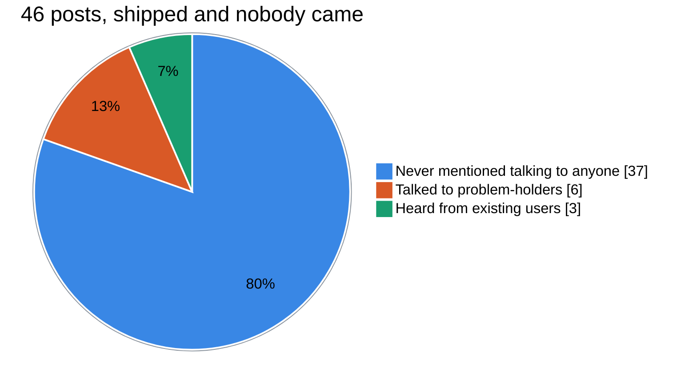
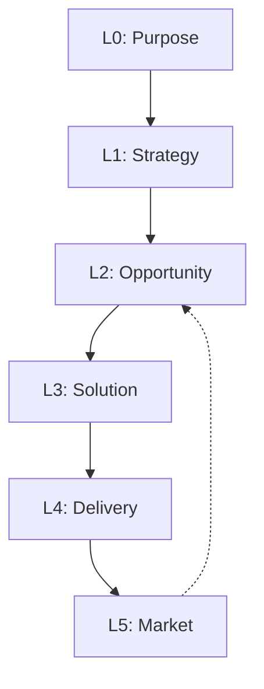

# Mycelium

**Outcome over output.**

You know how this goes. The idea turns up on a Thursday and it is a good one. The agent is quick and generous and by Sunday there is a working thing on your screen. It runs. You are pleased with it, and you have every right to be.

The building was never the hard part.

The hard part might've happened on Thursday, in about four minutes, mostly in your head. Who this is for. Whether any of them has actually said so. What would have to be true for it to matter to them. Which of those you were betting the weekend on.

Or it might not have happened at all. I like it, so other people will too. That is a real feeling, and from the inside it is almost impossible to tell apart from a reason.

Nobody skips that part because they think it doesn't matter. Something is always in the way, and it is usually something reasonable. On your own it is that asking anyone takes days and the agent is ready now. On a team I have watched it be end of season, a customer on the phone, the c-level with a gut feeling. I have got more than fifteen years of that, and I never met anyone who thought discovery was optional.

You know there are subreddits where people confess exactly this every week? I dropped down the rabbit hole for a count and found a clear structure. I read 46 posts where someone shipped their awesome product to nobody. Most of them never said they asked anybody if they needed what they built. A handful did. Mostly sideways. Like a sales call or a Facebook favor. Some were lucky enough to have existing users they could ask. I couldn't say that anyone asked their users up front.


```mermaid
%%{init: {"themeVariables": {"pie1": "#3987e5", "pie2": "#d95926", "pie3": "#199e70", "pieOpacity": "1", "pieStrokeColor": "#ffffff", "pieStrokeWidth": "2px", "pieOuterStrokeColor": "#8b949e", "pieOuterStrokeWidth": "2px", "pieSectionTextColor": "#000000"}}}%%
pie showData
    title 46 posts, shipped and nobody came
    "Never mentioned talking to anyone" : 37
    "Talked to problem-holders" : 6
    "Heard from existing users" : 3
```

Floor, not a rate. Nobody volunteers the thing they skipped. [The full read, all 46 posts](docs/receipts/cases/2026-08-16-l1-population-read.md).

What changed is that the agent made skipping it free. It goes from an idea to a pull request faster than any of those reasons ever could, and it never once stops to ask who the thing is for.

## The version where that goes well

Most of what gets thrown away in December was obvious back in August, if anyone had asked. Write the assumption down Thursday. Go find out Friday, while being wrong still costs nothing. The reasoning sits in git next to the code, hunch and all, so later you can tell whether you had a reason back in August or only wanted one. And loops short enough that you and the agent stay pointed at the thing you actually meant to build.

Same weekend. Spent once instead of twice.

## Where Mycelium comes in

It puts the questions where your agent works, and it makes the agent earn its first source file.

Four questions, before there is anything to build on. What is the problem, who has it, what are you assuming, what would show you wrong. Ten minutes, and the answers go into your repo as your spec. From there the agent has something to be held to, and so do you.

The gate itself fires the moment the agent reaches for a new source file in a repo where none of that exists yet. Once it does, it is quiet.

The gate is on the agent. The ten minutes are yours. That is the trade, your time up front against the agent's freedom to start without you.

This morning I ran it on a new idea: vibe-rant, a place for people whose AI-built projects have just fallen over to say so to each other. Four questions.

[Here is the whole thing happening](https://youtu.be/_GjMJcKcRjI), unedited, from typing `/mycelium:start` to the point where it starts asking which of the purpose properties are binding. No cuts, no narration, my own terminal.

And here is what it wrote down.

```yaml
why: >-
  So that a vibe-coding project crashing hard stops being a private, quiet defeat
  and becomes something a person takes to peers.

who:
  today: >-
    Unknown — not yet observed. Founder has seen rants online but has not spoken to
    anyone. Founder's own behaviour (in-cohort): fixes silently, tells no one.

workarounds:
  - workaround: "Go quiet and grind on the fix alone."
    who: "Founder, self-reported, in-cohort"
    note: "Directly contradicts the behaviour vibe-rant requires."

evidence:
  validated: false
  strength: speculation
```

[The repo is public](https://github.com/haabe/vibe-rant) if you want the whole file rather than my excerpt, along with the diamond and the decision log it wrote at the same time.

I am in the cohort I am building for, and I do the opposite of what the product needs. I said so out loud answering question two, and again on question three: the thing most likely to sink this is that everyone else *"stays quiet, like me"*. Instead of nodding along, it wrote that down as the most important line in the file and marked the whole brief `speculation`.

Confidence on that idea came out at 0.15. Nothing is blocked, I can still build it this afternoon. But I cannot now pretend I did not notice.

## When I would be wrong

Run it on three real projects. Not one, because writing anything down always feels clarifying the first time and that proves nothing. Three. If across all three the brief never once changed what you actually built, then it did not work for you, and you should say so out loud and uninstall it. That is a result I can be given and cannot argue with.

Here is the weakness I already know about. The discovery gate fires once per repo and then goes quiet for good. Nothing in this brings you back in November to check whether the thing you assumed in August held up. You have to want that, and if you do not, this buys you one good Thursday and no more.

I have got it wrong myself, which is where this started. The first thing Mycelium ever did was stop a macOS file viewer I wanted to build. It never got a line of code. When I went and investigated whether anyone other than me wanted it, that got debunked, including for the one person I had been picturing the whole time.

I do not know what finishing it would have cost me. Nobody does, which is the honest shape of evidence about a thing that did not happen. What I can count is the other side: that kill produced ten of the mechanisms this framework now runs on, and [they are listed in the write-up](docs/receipts/cases/2026-04-macos-fileviewer.md), badly-judged idea and all.

## What it costs

Roughly six thousand tokens a session, always on, measured on my own machine. Everything else loads when you use it.

Four hooks can hold work back, and here are all four. The discovery one fires when the agent creates a brand new source file in a project where nothing has been written down yet. Editing code you already have never reaches it, nor Markdown, and once your purpose file says something real it stops firing at all, so a bug fix on a Tuesday never meets it. The brownfield one asks once, ever, when you bring this to a repo that already has code. The scope one holds writes outside the paths a delivery cycle said it would touch. The preflight one asks for a re-read when your corrections file has changed under you. Seventeen more print a warning and let you past.

If you would rather not, write the date and your own words into `.claude/state/discovery-skip-ack` and it goes quiet in that repo for good. The agent is not allowed to write that file for you. That is what keeps the call yours.

Leaving is `/plugin uninstall`. Your canvas stays behind as plain YAML and reads fine without any of this.

## Start

```
/plugin marketplace add haabe/mycelium
/plugin install mycelium@haabe-mycelium    # the marketplace id is haabe-mycelium
/mycelium:start
```

Claude Code, signed in. Other agents in [install paths](docs/install-paths.md), and one of those is how the stranger below ran it.

## Where it is

Still pre-1.0, and the version number is doing real work rather than decoration. Schema and skill names move between minor versions, with migrations when they do. [What shipped and when](https://github.com/haabe/mycelium/releases). Three of my own projects, three people through a test cohort in May whose friction is most of what v0.31 became, and one stranger since.

For a team that needs a stable interface this is early. For your own project this afternoon, it has held up for the few of us who have run it, and whether that includes you is the thing the section above is for.

## The rest of the shape

Six layers, one diagram, and most projects never touch more than two or three of them in a weekend. Purpose sits at the top and mostly doesn't move. Everything below it does, which problem, which solution, the build, and what the market says back. Vibe-rant's L0 is fixed: a quiet failure becomes something you take to peers. Which problem that actually means, and which solution, is still live.


```mermaid
graph TD
    L0["L0: Purpose"]
    L1["L1: Strategy"]
    L2["L2: Opportunity"]
    L3["L3: Solution"]
    L4["L4: Delivery"]
    L5["L5: Market"]
    L0 --> L1 --> L2 --> L3 --> L4 --> L5
    L5 -.-> L2
```

The dotted line is what the market says back. It lands on opportunity rather than at the top, because what the market tells you usually changes which problem is worth solving next, not what you are for.

You do not run all of them. A weekend project skips most. `/mycelium:start` reads what you have and tells you which ones are worth your afternoon.

## When to use something else

If the decision is already made and you need throughput, Paddo's [boring agents](https://paddo.dev/blog/boring-agents-ship/) fit better. If the scope is settled and you want it built faster, [Addy Osmani's agent-skills](https://github.com/addyosmani/agent-skills). Several people editing one canvas at once is not built. And if the thing you are making carries no risk of being the wrong thing, this will feel like bureaucracy, because for you it would be.

## Someone else's

[dagfinndybvig/minilisp](https://github.com/dagfinndybvig/minilisp) is a Lisp interpreter by someone I have never met. Not a developer, ran it on Vibe with Mistral, and left his canvas and decision log in the repo on purpose. [Read what his ten minutes produced](https://github.com/dagfinndybvig/minilisp/blob/main/.claude/canvas/gist.yml) before you install anything of mine.

## Tell me either way

The thing you got built, or the point where it got in the way and you stopped. The second kind is rarer and I am more interested in those. [An issue](https://github.com/haabe/mycelium/issues), or [a discussion](https://github.com/haabe/mycelium/discussions).

If there's a business case underneath all this, it's still worth giving away for free. I have not found the case yet, and I am not looking very hard. I'd rather have the ten of you who actually run it than the argument about the hundred who might.

[Mental model](docs/mental-model.md) · [why it's opinionated](docs/philosophy.md) · [evaluate it](docs/evaluate.md) · [the skills](docs/skills/README.md) · [theory](docs/theories.md) · [other agents](docs/install-paths.md) · [everything](docs/README.md) · [credits](CONTRIBUTORS.md) · MIT
