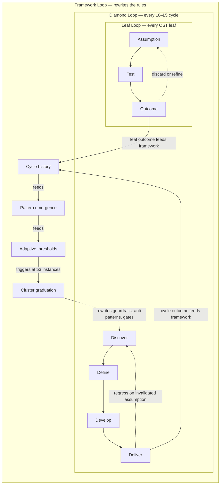

# Why Mycelium is opinionated

**Audience**: practitioners + evaluators wondering why the framework imposes structure rather than leaving choice to the user.
**Time to read**: 7 min.
**Last updated**: 2026-06-14.

The agent operating manual is [CLAUDE.md](../CLAUDE.md). This page is the human-facing rationale. They should agree, but they speak to different readers.

## The starting observation

AI has made building cheap. It has not made *deciding* cheap. An unharnessed agent will jump from an idea to a pull request without asking why, who for, or whether anyone needs it. The cost of the jump is borne by the human who has to undo the wrong build.

Other tools accelerate delivery. Mycelium tries to make the agent earn the right to start.

This is the load-bearing claim. Everything else follows from it.

## Why opinionated discipline

Discipline that the user can opt out of at any moment is not discipline; it is a suggestion. The agent's default behavior under context pressure is to skip — and the agent has more context pressure than a human.

So Mycelium picks specific gates, specific evidence shapes, specific theories, and enforces them. The opinionation is not arbitrary: every gate has a theory citation, every guardrail has a corrections.md entry that produced it, every cluster has a graduation criterion. The opinionation is auditable.

Underneath this sits a bet: that how a decision gets made is its own improvable part of the outcome, not just the skill of whoever makes it. That is what Amabile's componential theory of creativity names, and it is why a harness around the agent can change what ships, not only how fast.

The cost of opinionation: when your work does not match the framework's shape, the framework feels heavy. The fix for that is not "make the framework lighter for everyone"; it is "be honest about who the framework is and is not for". See [evaluate.md](evaluate.md) and the README's Who-it's-not-for section.

## Why theory-grounded

Every gate, every canvas, every skill cites the theory it is grounded in. This is not academic showmanship. It is two things:

1. **Drift detection.** When the framework moves, the citation makes the drift visible. If a gate stops checking what its theory says it should check, that is the documented-rule-diverges-from-enforcement cluster shape (8 instances in the cluster log as of 2026-05-08), and the framework has machinery to catch and graduate it.
2. **Outside critique.** A practitioner who knows the theory can audit Mycelium's interpretation of it. Drew Hoskins did this with scenarios — his SAP talk slides showed Persona + Means + Motive + Simulation; Mycelium had been doing scenarios implicitly. Hoskins's critique landed because the theory was named.

The framework cites Lanham et al. (2023) on faithful citations: the cite must be the *actual* reason for the move, not a plausible after-the-fact rationalization. The `(per: <source>)` discipline at every recommendation site is the operating form.

## Why in-loop preventive (not post-run evaluative)

Mycelium's strategic positioning is the in-loop preventive layer. Gates fire DURING the agent's loop to block progression on insufficient evidence; they do not score outputs after the fact.

Why this matters: the cost of building the wrong thing scales with how far down the loop the wrongness gets. A gate at L0→L1 catches it at the cheapest point. A post-run evaluator (Anthropic Outcomes, the GitHub PR check) catches it after the cost has been paid.

Both layers are valid. Mycelium specializes upstream. The L1 strategic_frame articulates this distinction explicitly (see `canvas/landscape.yml#strategic_frame`).

The cost of in-loop: friction. Every gate is a place the agent can stall. The cost of post-run: wasted work. Both are real; the framework picks the upstream side because the wasted-work cost compounds and the friction cost stays constant.

## Why a fractal double-loop (not a flat iteration cycle)

DevOps and similar frameworks run a single-loop: Plan → Develop → Test → Release → Operate → Monitor → Plan. Same loop, executed faster each cycle. Mycelium runs a **fractal double-loop**: three iteration levels operating simultaneously, where each cycle's outcomes rewrite the rules the next cycle runs under.

The three levels:

- **Leaf loop** — every OST solution leaf iterates assumption → test → outcome until it advances, regresses, or discards.
- **Diamond loop** — every L0–L5 diamond iterates Discover → Define → Develop → Deliver, with explicit regression-on-invalidated-assumption pushing back to earlier phases.
- **Framework loop** — completed and discarded cycles feed cycle-history, which feeds pattern emergence, which feeds cluster graduation, which rewrites guardrails, anti-patterns, and adaptive thresholds. The framework you run the next cycle in is not the framework you ran the previous cycle in.

This is what Argyris named double-loop learning, made operational. The framework's mechanisms for cluster graduation (`memory/cluster-instances.md`), pattern emergence (`engine/pattern-detector.md`), and adaptive thresholds (`engine/adaptive-thresholds.md`) are wired together so each cycle's evidence updates the framework's own rules. DevOps has the iteration; Mycelium has the iteration *plus* the rule-rewrite.

The cost: thicker harness, more state to track. The payoff: a framework that gets sharper from its own use, where today's instance of a recurring failure becomes tomorrow's mechanical guardrail. Anti-pattern #7 (Consistency-as-Evidence) was graduated this way after the cluster crossed its instance threshold; the `agent-as-instrument-on-shadow-logs` cluster opened 2026-05-12 is the next candidate.

The fractal claim is also operational, not decorative: the three loops are not identical-and-nested but self-similar-and-different. Leaves have a pipeline-with-back-edges shape; diamonds have a four-phase shape with regression; the framework loop has a pattern-emergence-and-graduation shape. Same iteration logic, different phase structures — what fractal means in the strict mathematical sense.

Wardley names this from the practitioner side: the skill of asking questions is distinct from the skill of answering them, and the leverage is in protecting **time-to-question (ttQ)** from being crowded out by time-to-answer (ttA) ([Rewilding Software Engineering, ch. 3](https://www.swardleymaps.com/posts/2025-02-06-rewilding-software-engineering)). Mycelium's three loops are the structural answer to where ttQ gets protected and where ttA gets accelerated: leaves protect ttQ within a solution space, diamonds protect it across solution spaces, the framework loop protects it across cycles by rewriting which questions count as interesting.

## Why dogfood is required (not optional)

The framework is dogfooded on the framework. The friction the founder hits while building Mycelium becomes corrections that shape Mycelium. The `meta_dogfood` project type formalizes this — when a project's purpose is "improve the framework", canvas writes target the framework's own discovery scales.

Why required: a framework that does not run on itself has no feedback loop. It accumulates aspirational rules. Mycelium's claim is that it runs on itself, which is testable: the corrections.md and cluster-instances.md ledgers are the test.

The strongest receipt is [framework-self-correction (May 2026)](receipts/cases/2026-05-01-framework-self-correction.md) — a four-day cycle where Mycelium's own harness flagged recurring patterns in its own work and graduated them into mechanism without a new project. That is what dogfood looks like when it works.

The next-strongest is the [macos-fileviewer kill](receipts/cases/2026-04-macos-fileviewer.md) — the project that did not ship contributed more to the framework than the two that did. The framework forced a stop with evidence; the kill produced 10 framework features.

If your evaluation finds that the framework's own corrections log is sparse or vague, the framework is not dogfooding well, and the load-bearing claim falls apart. Audit the corrections log; the receipt stands or it does not.

## Why "build to learn, then build to earn"

Patton/Cagan distinction. Discovery work is built to learn — the artifact may be discarded once the learning lands. Delivery work is built to earn — it has to ship and run. Mycelium gates which mode applies before the agent commits scope.

This is the conceptual ground for the diamond's divergent / convergent phases: Discover and Develop are divergent, build-to-learn; Define and Deliver are convergent, build-to-earn-ish. Mixing them collapses both — you get fragile prototypes the team commits to, or hardened-too-early infrastructure that pivots badly.

The framework refuses to let the agent build-to-earn during a build-to-learn phase. That refusal is the gate.

## Why structure before content

The Phase 1 of the docs restructure (this version) shipped the docs/ structure with stub pages. Phase 2 fills the content. The order is deliberate — in Mycelium's own discipline:

- **L1 → L2 → L3 → L4**: spec before mechanism, structure before content
- **Mocked persona before real interviews**: speculation tagged before evidence weighted
- **Schema before data**: validation contract before the first row

The docs restructure dogfooded its own framework: spec the metadocumentation, then fill the docs. If the metadocumentation does not survive the fill, the metadocumentation was wrong; that is also a learning.

## What Mycelium does not yet do (single-team scope cut)

The framework's data model and orchestration model both assume **one author / one team / one diamond-flow at a time**. This is a deliberate scope cut, not an oversight, and it is worth naming because Team Topologies vocabulary (stream-aligned, platform, X-as-a-Service) is present in the framework as *described content* — there is a `/mycelium:team-shape` skill, the L1 strategy table cites Skelton, and `canvas/team-shape.yml` exists — without being present as an *operational discriminator* on artifacts. Nothing else in the system reads what `team-shape.yml` produces.

A 2026-05-09 multi-agent dogfood ran the framework against itself with parallel subagents simulating stream-aligned and platform team members on a shared canvas (full report: `.claude/evals/dogfood-reports/2026-05-09-team-topologies-simulation.md`). Two-agent independent corroboration surfaced four absences:

- **No `owned_by_team` field anywhere in canvas.** Searched all schemas — opportunities, leaves, decisions, human-tasks, metric sources, all carry no team discriminator. Single-team assumption is baked across the canvas.
- **No stream→platform request-routing primitive.** `human-tasks.yml` is the only inbox-shaped artifact, but its type enum is locked to user-research verbs (interview, observation, survey). There is no `platform_request` / `adapter_request` type, and misuse-fitting it would corrupt the artifact's discipline.
- **No interface-contract / "what the platform exposes" doc.** `metrics-adapters/TEMPLATE.md` is a build-it-yourself template, not a "what platform commits to ship" surface. Stream teams have no way to distinguish "ask the platform" from "build it yourself" — the framework's default answer is always the latter.
- **Silent semantic overwrite on multi-author canvas writes** survives git merge because provenance fields are single-valued (no per-entry author/date/type discriminator). Two parallel team members both adjusting the same opportunity's confidence would last-writer-win without any signal.

There is also a real architectural tension to name: Mycelium's JiT philosophy ("detect-and-generate over pre-shipped catalogs") collapses, in a multi-team world, into "every stream builds its own adapter," which negates a platform team's value proposition. The two principles need reconciliation if multi-team operation becomes load-bearing.

**Why none of this is fixed yet.** N=1 simulation is not adoption evidence. The framework's promotion bar (see `engine/consistency-check-spec.md`) wants instances of lived friction, not constructed ones. Subagent simulation surfaces mechanism issues honestly and fabricates social ones; the social findings (cognitive load felt-sense, handoff awkwardness, Conway pressure) — the things Team Topologies actually cares about — would require real two-team adoption to test. The right move is to wait for real adopters and promote primitives based on lived friction, not to ship speculative multi-team scaffolding the framework cannot yet justify.

**Trigger for revisiting.** A real adopter brings an actual two-team setup (stream + platform, or two streams sharing canvas), runs Mycelium for 2-3 weeks, and reports back. If the same four absences surface as lived friction, that is mechanism-promotion evidence. Until then, the scope cut stands.

If you are evaluating Mycelium for multi-team use today, the honest answer is: not yet. Solo founder + agent dyad, or a single team that treats canvas as shared documentation with all members editing serially, is the supported shape.

## What this implies for the reader

If you find yourself disagreeing with the load-bearing claims above — that the agent should earn the right to start; that gates should fire upstream; that theory citations should be faithful; that dogfood is required — the rest of the framework will read as ceremony, because it follows from these claims.

If you nod along, the rest of the framework reads as infrastructure, because it follows from these claims.

The two readings are not symmetric. The framework does not try to convert the first reader; it tries to be honest enough that the first reader exits fast and the second reader stays.

## See also

- [How to think in Mycelium](mental-model.md) — the mental model in one worked example (this page is the *why*; that one is the *how*)
- [theories.md](theories.md) — the 30+ frameworks Mycelium integrates
- [evaluate.md](evaluate.md) — anti-promotional evaluation surface
- [docs/contributing/style.md](contributing/style.md) — voice rules that follow from this philosophy
