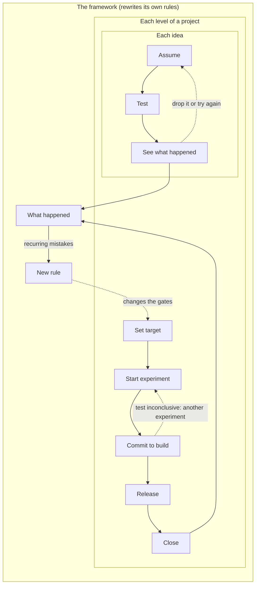

# Why Mycelium is opinionated

**Audience**: you have read the README or [what discovery before the build gives you](mental-model.md), and you want to know why it is so strict before you decide.
**Time to read**: 6 min.
**Last updated**: 2026-10-02.

The README makes a few big claims. The agent has to earn the right to start. The gates are not optional. The framework learns from its own mistakes. This page is where those claims come from, and how you can check them yourself.

## The starting observation

AI has made building cheap. It has not made deciding cheap. An agent left to itself will jump from an idea to a pull request without asking why, who for, or whether anyone needs it. The cost of that jump is paid by the person who has to undo the wrong build.

Other tools speed up delivery. Mycelium tries to make the agent earn the right to start. Everything else on this page follows from that.

## Why you cannot just switch it off

Discipline you can opt out of at any moment is not discipline. It is a suggestion. And under pressure the agent skips first, because it has more context to juggle than you do and less reason to care.

So Mycelium picks specific gates and specific kinds of evidence, and holds the agent to them. That is a strong opinion, and it costs something. When your work does not fit the shape, it feels heavy. The answer to that is not to make it lighter for everyone. It is to be honest about who it is for, which is what the last section of this page is for.

There is a bet underneath. How a decision gets made is a part of the result you can improve, not just the skill of whoever makes it. Teresa Amabile's theory of creativity names the process as one of its parts, and that is why a structure around the agent can change what ships, not only how fast.

## Why every rule points at a theory

Every gate names the theory it comes from. Evidence, the four risks of a product (Cagan), the job people hire it for (Christensen), the kind of problem you are in (Snowden's Cynefin), and so on. That is not academic decoration. It does two things for you.

You can catch it drifting. If a gate stops checking what its theory says, the gap is visible, and Mycelium audits itself for exactly that kind of gap.

And you can argue with it. Someone who knows the theory can read how Mycelium uses it and say where it is wrong. Drew Hoskins did that with scenarios, and the framework changed because of it.

That cuts both ways, and here is the receipt. This page once cited a talk by Hoskins that does not exist. The mistake was caught and fixed in the theory list, and survived here for four more weeks, in the very paragraph arguing that naming your sources makes them checkable. A sweep found it. Naming a source is what makes the check possible. It is not the check.

The rule Mycelium holds itself to comes from Lanham and colleagues (2023), who studied whether a model's stated reasons are its real ones. A source named next to a decision has to be the actual reason for it, not a respectable one found afterwards.

## Why the gate sits before the work

Mycelium sits inside the agent's loop. Its gates stop the agent before the work, instead of scoring the result after.

Why this matters? The cost of building the wrong thing grows with how much gets built on top of it before anyone notices. A gate before the first decision catches it while it is cheap. A review after the build catches it once the cost is already paid.

Both kinds of check are useful, and Mycelium only does the first. Every gate is a place where the agent can stall, and that friction is real. But the friction stays the same size, and wasted work keeps growing. So it picks the friction. The numbers behind that, and the stories, are on [what discovery before the build gives you](mental-model.md).

## Why it learns from its own mistakes

Most process runs one loop, faster each time. Mycelium runs three, one inside the other.

- **The smallest loop** is a single idea being tested. Assume, test, see what happened, try again or drop it.
- **The middle loop** is how every level of a project moves, from strategy down to a release. It moves by decisions you record. Set a target, start an experiment, commit to build, release, close. A failed test does not send you back. You record the next experiment, and the old one stays on the record.
- **The outer loop** is the framework itself. Mistakes that keep coming back turn into new rules, so the Mycelium you run next month is not quite the one you ran this month.

```mermaid
graph LR
    subgraph FW["The framework (rewrites its own rules)"]
        direction TB
        CH["What happened"] -->|"recurring mistakes"| CG["New rule"]
        CG -.->|"changes the gates"| ST

        subgraph DI["Each level of a project"]
            ST["Set target"] --> SE["Start experiment"] --> CB["Commit to build"] --> RL["Release"] --> CL["Close"]
            CB -.->|"test inconclusive: another experiment"| SE

            subgraph LF["Each idea"]
                AS["Assume"] --> TS["Test"] --> OU["See what happened"]
                OU -.->|"drop it or try again"| AS
            end
        end

        CL --> CH
        OU --> CH
    end
```

Chris Argyris called this double-loop learning. You do not only fix the mistake, you change the rule that let it happen. That is where the "it learns" claim comes from. One example. In June 2026 the agent built an integration for another coding tool by reading its source code, called it verified, and it broke on every run. A person asking for a real run is what caught it. It was the latest in a family of the same mistake, taking something on trust without checking it, so it became a rule. A claim that something works now needs the run behind it.

It has a cost. More state to keep, and a thicker layer around the agent. And it has a payoff. A recurring failure today becomes a check tomorrow.

Simon Wardley puts the same idea from the practitioner's side. Asking the question is a different skill from answering it, and the time for questions gets crowded out by the time for answers unless something protects it. The three loops are where it is protected.

Until v0.306.0 the middle loop was four phases (Discover, Define, Develop, Deliver), the same at every level. I reopened that on 2026-09-30. "The double diamond approach for each scale was my hypothesis... It might be wrong. In that case I want a better solution." A review of the sources found none that prescribes the same four phases at every level, so the loop replaced it.

## Why it has to run on itself

Mycelium is built with Mycelium. The friction I hit while building it becomes the next rule.

Why I say it's required? A framework that does not run on itself has no way to learn. It collects rules that sound good. So the claim is testable. The [log of corrections it made to itself](../.claude/memory/corrections.md) is public, and you can read it.

Two receipts. In [four days in May 2026](receipts/cases/2026-05-01-framework-self-correction.md) its own checks flagged patterns in its own work and turned them into rules, with no new project involved. And [a file viewer that was never built](receipts/cases/2026-04-macos-fileviewer.md) was stopped before a line of code, when four of six simulated users said they would not switch to it. The project that did not ship gave Mycelium ten of its features.

If you read that log and find it thin or vague, the claim falls apart. That is the point of making it public.

## Why it learns before it earns

Jeff Patton and Marty Cagan separate building to learn from building to earn. Discovery work is built to learn, and you may throw the result away once you have the answer. Delivery work is built to earn, and it has to ship and keep running.

In Mycelium these are two modes, and you never declare them. They are read off what a level has decided. Before it commits to build, it is learning. After, it is earning. Mix the two and you get the worst of both, a fragile prototype the team ends up depending on, or hardened infrastructure built before anyone knew it was the right thing.

So the agent is not allowed to build to earn while a level is still learning.

## Is it for you and your team?

It is built for one person working with an agent, or a small team sharing one repository and taking turns on the same files.

It is not built for several teams working on the same plan at once. I tried that in a simulation in May 2026 and found the gaps. Nothing records which team owns what, and two people changing the same record at the same time would overwrite each other without a warning. I have not fixed it, because a simulation is not people using it. If you run it with two teams for a few weeks and the same gaps hurt, that is what changes it.

And if your idea carries no real risk of being the wrong thing, this will feel like bureaucracy, because for you it would be. [When to use something else](../README.md#when-to-use-something-else).

If you disagree with the claims above, that the agent should earn the right to start, that the gate belongs before the work, that its sources should be real, that it has to run on itself, the rest of Mycelium will read as ceremony. If you nod along, it reads as infrastructure. It does not try to win over the first reader. It tries to be honest enough that the first reader leaves early and the second one stays.

## What to do next

- **Try it on your next idea.** [Install it and run `/mycelium:start`](get-started.md). The first round of discovery takes about ten minutes.
- **Evaluating it for a team?** [Give it an hour](evaluate.md).
- **Check the sources.** [Every theory behind the gates, and where each is wired in](theories.md), and the [corrections log](../.claude/memory/corrections.md) the framework keeps on itself.
- **Look under the hood.** [How it is built](architecture.md), including what the multi-team simulation found.
