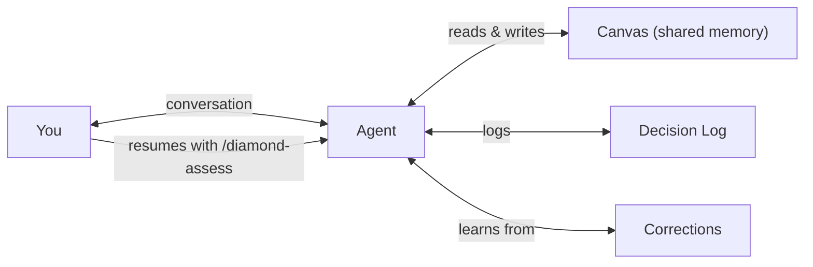
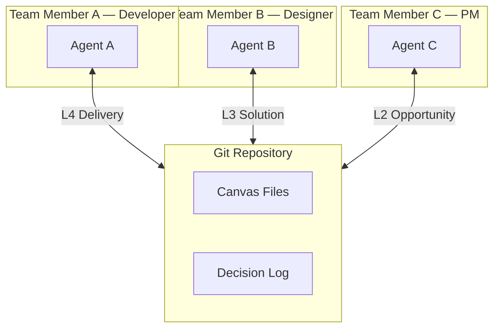
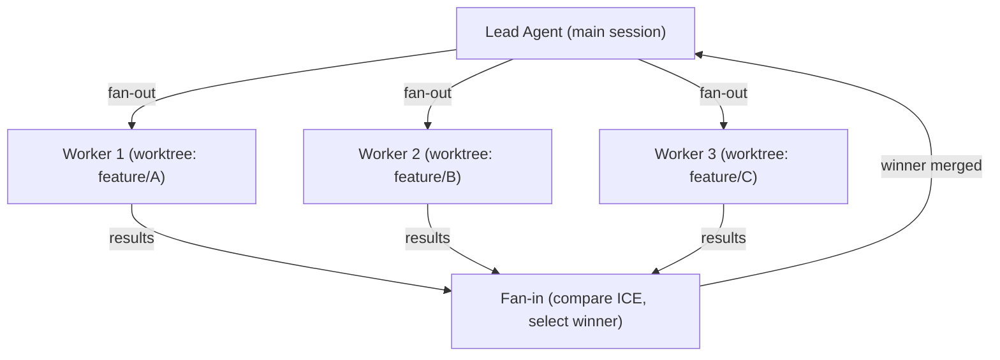

# Usage modes

**Audience**: solo developers, teams, and agent integrators choosing how to apply Mycelium.
**Time to read**: 10 min.
**Last updated**: 2026-05-08.

Four modes. Pick the one your work shape matches.

## Solo developer

One builder, one agent, one canvas. The agent is your product thinking partner — it remembers context between sessions so you do not have to.

Resume a session with `/diamond-assess`. The agent reads the canvas state and tells you where you are.

This is the mode the founder dogfoods Mycelium in. It is the most-tested mode, and the least-load-bearing claim — the framework demonstrably works for one person.

## Team mode

Canvas files are committed to git — they become shared product documentation. Any team member's agent reads the same state. Different members can work on different diamonds simultaneously.

Canvas updates are PR-reviewed like code changes. Everyone sees the same product state.

### Canvas-sync conflict resolution

Asked at the 2026-05-07 Juniors.dev presentation Q&A: "When two team members edit the same canvas file, how does Mycelium handle the conflict?"

Mechanics:

1. **Canvas files are YAML committed to git.** Conflicts resolve through git's normal merge — same as code.
2. **`_meta` blocks are the source-of-truth markers.** Every canvas section can carry `_meta.version`, `_meta.last_validated`, `_meta.evidence_type`, `_meta.structural_level`. The merge respects these.
3. **Field-level merges are mechanical.** If branch A edits `purpose.who.primary` and branch B edits `purpose.why`, the merge is clean.
4. **Same-field conflicts use the higher `_meta.last_validated` date by convention.** More-recent evidence supersedes older. If dates tie, escalate to the team — git's conflict markers will show both versions.
5. **`/canvas-sync` packages canvas state for cross-session sync.** It does not auto-merge — git does that. The skill is a courtesy wrapper for "here is the canvas delta since you last pulled".

Common patterns:

- **Two branches edit different opportunities in `opportunities.yml`**: clean merge.
- **Two branches edit the same opportunity's evidence array**: append-only by convention — both arrays merge if no field-level overlap.
- **Two branches edit the same evidence entry's `confidence`**: keep the later `last_validated`; the earlier becomes a corrections.md entry ("this confidence was superseded; investigate").

The team's discipline matters more than the framework's: if your team's branches diverge widely on canvas content, the merge cost is high. The fix is upstream — better diamond ownership (one diamond, one owner, like product practice).

### UX/dev handover (Juniors.dev shape)

Juniors.dev's structure is a UX-research-heavy front handing off to a dev-heavy back. Mycelium's diamond model fits this directly: UX owns L0–L2 (purpose, opportunities, scenarios); dev owns L3–L4 (solution, delivery). The canvas is the shared boundary. The handover becomes "read the canvas" rather than "schedule a meeting".

Concrete pattern:

- UX runs `/interview`, `/jtbd-map`, `/ost-builder` — populates `purpose.yml`, `jobs-to-be-done.yml`, `opportunities.yml`, `scenarios.yml`.
- UX commits the L2 OST winner. The leaf-lifecycle.md phase 5 hands off to L3.
- Dev pulls, runs `/diamond-assess`, sees "L2 closed, L3 ready". Runs `/gist-plan`, `/preflight`, `/delivery-bootstrap`.
- Both can write to the canvas at any time; conflicts merge per the rules above.

## Agent orchestration

When the OST has multiple solutions to explore in parallel, Mycelium fans out worker agents — each in an isolated git worktree. The lead agent coordinates, compares results, and selects the winner.

Workers get read-only canvas access and worktree isolation. Only the lead agent updates canvas and progresses diamonds. Use `/fan-out` to start parallel exploration.

The bakeoff protocol structures the comparison: see `plugins/mycelium/orchestration/leaf-bakeoff.md`.

## JIT tooling mode (any of the above)

Mycelium is language-agnostic and product-type-agnostic. When a delivery diamond begins, the framework auto-detects the tech stack (or product type) and generates appropriate validation. Universal principles (DRY, KISS, OWASP) apply to all stacks.

The same pattern applies to metric sources. `/metrics-detect` scans for signals and asks about channels the repo cannot reveal; `/metrics-pull` then turns "I checked the dashboard" into timestamped, sourced, diffable evidence.

See [jit-tooling.md](jit-tooling.md) for depth.

## Picking a mode

| If you have... | Use... |
|---|---|
| One builder, one project | Solo |
| Multiple builders on one product | Team |
| One leaf with 2+ competing solutions to compare | Solo or Team + agent orchestration on top |
| Non-default tech stack or product type | JIT tooling layered on whichever fits |

## See also

- [README](../README.md#how-it-works) — diamond model overview
- [jit-tooling.md](jit-tooling.md) — detection and adapter generation
- [skills/README.md](skills/README.md) — full skill index
- `plugins/mycelium/orchestration/modes.md` — full operations reference
