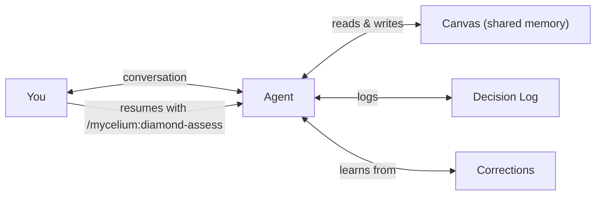
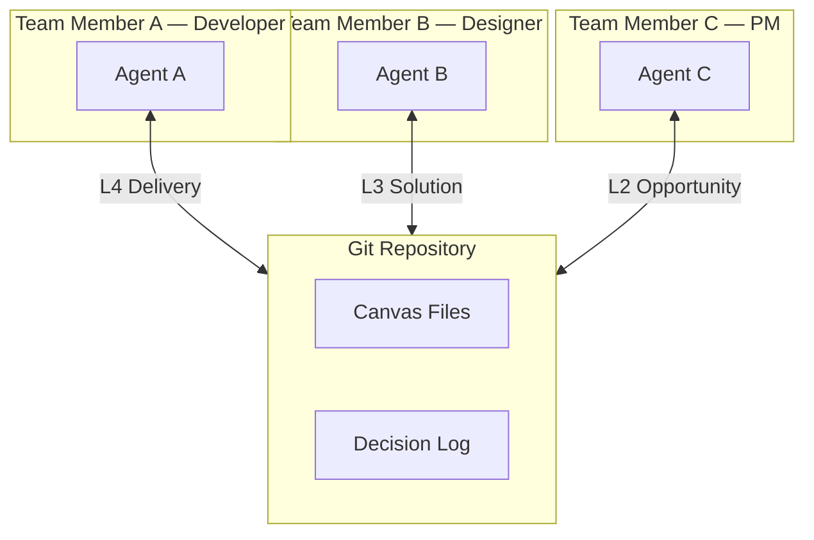
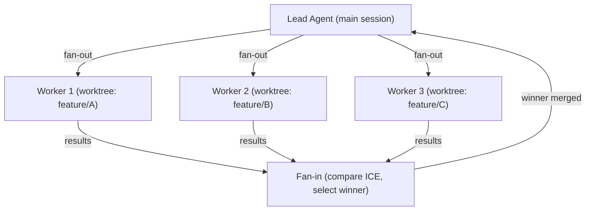

# Usage modes

**Audience**: solo developers, teams, and agent integrators choosing how to apply Mycelium.
**Time to read**: 10 min.
**Last updated**: 2026-10-03.

Four modes. Pick the one your work shape matches.

## Solo developer

One builder, one agent, one canvas. The agent is your product thinking partner — it remembers context between sessions so you do not have to.

```mermaid
graph LR
    YOU["You"]
    AGENT["Agent"]
    CANVAS["Canvas (shared memory)"]
    DECISIONS["Decision Log"]
    CORRECTIONS["Corrections"]

    YOU <-->|"conversation"| AGENT
    AGENT <-->|"reads & writes"| CANVAS
    AGENT <-->|"logs"| DECISIONS
    AGENT <-->|"learns from"| CORRECTIONS
    YOU -->|"resumes with /mycelium:diamond-assess"| AGENT
```

Resume a session with `/mycelium:diamond-assess`. The agent reads the canvas state and tells you where you are.

This is the mode the founder dogfoods Mycelium in. It is the most-tested mode, and the least-load-bearing claim — the framework demonstrably works for one person.

## Team mode

Canvas files are committed to git — they become shared product documentation. Any team member's agent reads the same state. Different members can work on different diamonds simultaneously.

```mermaid
graph TD
    subgraph GIT ["Git Repository"]
        CANVAS["Canvas Files"]
        DECISIONS["Decision Log"]
    end

    subgraph MEMBER1 ["Team Member A — Developer"]
        A_AGENT["Agent A"]
    end

    subgraph MEMBER2 ["Team Member B — Designer"]
        B_AGENT["Agent B"]
    end

    subgraph MEMBER3 ["Team Member C — PM"]
        C_AGENT["Agent C"]
    end

    A_AGENT <-->|"L4 Delivery"| GIT
    B_AGENT <-->|"L3 Solution"| GIT
    C_AGENT <-->|"L2 Opportunity"| GIT
```

Canvas updates can be reviewed in pull requests like code. Everyone sees the same product state.

### When two people edit the same canvas file

Canvas files are YAML committed to git, so git merges them as text, the same as code. Mycelium adds no merge logic of its own.

- **Different entries** (two opportunities in `opportunities.yml`, or `who` on one branch and `why` on the other): git merges them cleanly.
- **The same field on both branches**: git shows a conflict. Decide it by hand. The framework's rule is that the version with more evidence behind it wins.
- **`/mycelium:canvas-sync`** is a short checklist for the routine: pull, run `/mycelium:diamond-assess`, commit the canvas, the diamonds, the decision log and memory. It does not merge anything.

Several people editing one canvas at the same moment is not something Mycelium is built for yet.

The team's discipline matters more than the framework's: if your team's branches diverge widely on canvas content, the merge cost is high. The fix is upstream — better diamond ownership (one diamond, one owner, like product practice).

### UX/dev handover

A common team shape is a UX-research-heavy front handing off to a dev-heavy back. Mycelium's diamond model fits this directly: UX owns L0–L2 (purpose, opportunities, scenarios); dev owns L3–L4 (solution, delivery). The canvas is the shared boundary. The handover becomes "read the canvas" rather than "schedule a meeting".

Concrete pattern:

- UX runs `/mycelium:start`, `/mycelium:jtbd-map`, `/mycelium:ost-builder`, which populate `purpose.yml`, `jobs-to-be-done.yml`, `opportunities.yml`, `scenarios.yml`.
- UX records the L2's target (`set_target`), and `/mycelium:ost-builder` offers an L3 on that target. The L2 stays open above it.
- Dev pulls, runs `/mycelium:diamond-assess`, sees the L3 open. Runs `/mycelium:gist-plan`, `/mycelium:preflight`, `/mycelium:delivery-bootstrap`.
- Both can write to the canvas at any time; conflicts merge per the rules above.

## Agent orchestration

When the OST has multiple solutions to explore in parallel, Mycelium fans out worker agents — each in an isolated git worktree. The lead agent coordinates, compares results, and selects the winner.

```mermaid
graph TD
    LEAD["Lead Agent (main session)"]

    LEAD -->|"fan-out"| W1["Worker 1 (worktree: feature/A)"]
    LEAD -->|"fan-out"| W2["Worker 2 (worktree: feature/B)"]
    LEAD -->|"fan-out"| W3["Worker 3 (worktree: feature/C)"]

    W1 -->|"results"| FANIN["Fan-in (compare ICE, select winner)"]
    W2 -->|"results"| FANIN
    W3 -->|"results"| FANIN

    FANIN -->|"winner merged"| LEAD
```

Workers are told to treat the canvas as read-only and run in git worktrees the lead creates. Only the lead updates the canvas and progresses diamonds. That is an instruction to the agents, not a lock. Use `/mycelium:fan-out` to start parallel exploration.

The bakeoff protocol structures the comparison: see `plugins/mycelium/orchestration/leaf-bakeoff.md`.

## JIT tooling mode (any of the above)

Mycelium is language-agnostic and product-type-agnostic. `/mycelium:delivery-bootstrap` detects the tech stack (or product type) and sets up matching validation. The agent offers it when delivery starts, and you can run it any time. Universal principles (DRY, KISS, OWASP) apply to all stacks.

The same pattern applies to metric sources. `/mycelium:metrics-detect` scans for signals and asks about channels the repo cannot reveal; `/mycelium:metrics-pull` then turns "I checked the dashboard" into timestamped, sourced, diffable evidence.

See [jit-tooling.md](jit-tooling.md) for depth.

## Picking a mode

| If you have... | Use... |
|---|---|
| One builder, one project | Solo |
| Multiple builders on one product | Team |
| One leaf with 2+ competing solutions to compare | Solo or Team + agent orchestration on top |
| Non-default tech stack or product type | JIT tooling layered on whichever fits |

## See also

- [README](../README.md#the-rest-of-the-shape): diamond model overview
- [jit-tooling.md](jit-tooling.md): detection and adapter generation
- [skills/README.md](skills/README.md): full skill index
- `plugins/mycelium/orchestration/modes.md`: full operations reference
