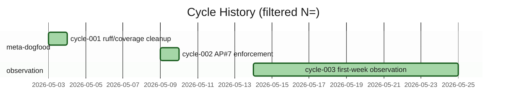
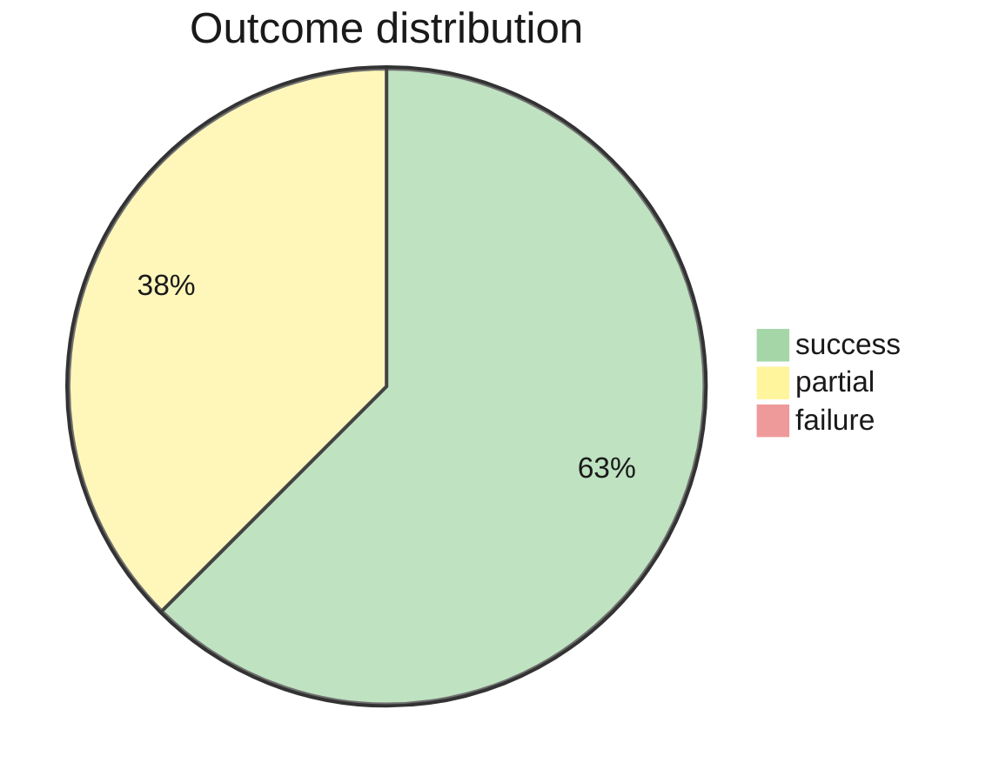

# Cycle Render

Read-only render of `.claude/canvas/cycle-history.yml` as gantt + pie + (optionally) json. Third specialist in the render fleet. See `${CLAUDE_PLUGIN_ROOT}/engine/render-conventions.md` for shared conventions.

## When NOT to use

- For cross-cutting opportunity→solution→cycle traceability view → dispatcher's `/mycelium:render --view traceability` (deferred to Phase 4a–4d research-first methodology).
- To RECORD a new cycle outcome → `/mycelium:retrospective`, `/mycelium:ice-score` (on discard), or `/mycelium:launch-tier` (on launch). This skill is read-only.
- For framework-health full assessment → `/mycelium:framework-health`. cycle-render emits one visualization piece; framework-health is the broader audit.

## Identifier exposure

**Declared**: YES

### Scope (canvas surfaces touched)

| Canvas file | Identifier-bearing fields | Frequency |
|---|---|---|
| `.claude/canvas/cycle-history.yml` | `learnings.process` prose; `learnings.framework` prose; `related_corrections` references | mid (cohort-related observation cycles directly reference participants) |
| `$MYCELIUM_ATTRIBUTION_REGISTRY` env var (canonical) or `.claude/memory/attribution-registry.yml` (fallback) | `people:` block with `name`+`consent`+`note` per entry | read-only consultation; never rendered |

### Rationale

Cycle history is reflection-shaped: `learnings.process` is prose-heavy and often names testers whose feedback drove the cycle (e.g., a cycle entry with `leaf_id: ht-014-alex-first-week-observation` carries an identifier in the leaf_id itself). Identifier exposure is structural to the learnings narrative, not incidental. Consent state for named cohort testers can shift over time per the consent-state-change-skip cluster (anti-pattern #7 sub-shape #15) — cycle-render re-consults the registry on every invocation, never caches.

### Anon-label convention

Per `engine/render-conventions.md#anon-label-convention`. Numbering shared across the render-fleet session (cohort-tester-N in cycle-003 IS cohort-tester-N in opp-004 evidence if both rendered in one session).

In gantt output, anon labels appear in `section` names and task IDs. In ascii output, in chronological listings. In json output, in `learnings_process` strings AND a parallel `identifier_map` field for auditability.

### Consent value semantics

Per `engine/render-conventions.md#consent-value-semantics`. `public_ok` → render literal + carve-out footnote pointer if entry has non-empty `note:`. `generic_only` → redact to anon-label. `unknown` → treat as `generic_only`. Not-in-registry → fail loud unless `--no-identifiers=true`.

### Worked examples

**public_ok cohort tester → literal**: cycle entry with leaf_id `ht-014-alex-first-week-observation`, registry entry `{name: "Alex", consent: public_ok, note: "..."}` → gantt section reads `Alex first-week observation` + carve-out footnote pointer.

**generic_only → anon-label**: a future cycle naming "Random Tester" with registry `consent: generic_only` → gantt section reads `cohort-tester-N first-week observation` + anon-mapping footnote.

**Maintainer literal**: a cycle prose mentions "Håvard's Torres-shape question", registry `{name: "Håvard", consent: public_ok}` → renders literally.

**Identifier not in registry → fail loud**: a future cycle adds a tester never registered → fail-loud per `engine/render-conventions.md`. The upstream fix is in `/mycelium:retrospective` (consult registry on cycle recording); cycle-render is the downstream gate.

### Fixture pointer

- `tests/bash/fixtures/cycle-render/redaction-public-ok-literal-gantt.yml`
- `tests/bash/fixtures/cycle-render/redaction-generic-only-anon-gantt.yml`
- `tests/bash/fixtures/cycle-render/redaction-public-maintainer.yml`
- `tests/bash/fixtures/cycle-render/redaction-no-registry-entry-fail-loud.yml`
- `tests/bash/fixtures/cycle-render/redaction-carve-out-note-footnote.yml`

## Preflight: Read sources

1. Read `.claude/canvas/cycle-history.yml` with the Read tool. Full read; not `limit:1`.
2. Read the attribution registry per path resolution order in `engine/render-conventions.md#registry-path-resolution`: `$MYCELIUM_ATTRIBUTION_REGISTRY` env var first; fall back to `.claude/memory/attribution-registry.yml`. If registry absent, surface a `⚠ no attribution-registry — consent-redaction not enforceable; treat output as roadmap-internal` warning in the render header.
3. Note canvas-state timestamp per `engine/render-conventions.md#canvas-state-timestamp-resolution`: `_meta.last_validated` if present; fall back to top-level `last_updated:`.

## Arguments

| Arg | Default | Values | Effect |
|---|---|---|---|
| `--format` | `mermaid` | `mermaid` \| `ascii` \| `json` | Output format. `markdown-table` and `markdown-list` are NOT supported (gantt doesn't map cleanly); fail loud per `engine/render-conventions.md#format-support-negotiation-global-rule`. |
| `--view` | `both` | `gantt` \| `pie` \| `both` | Which diagram(s) to emit. |
| `--theme` | `base` | `base` \| `dark` | Theme. `dark` is the WCAG-by-construction opt-in per `engine/render-conventions.md#wcag-aa-theme-convention`. |
| `--since` | `null` | ISO date | Filter cycles whose `started_at` is on or after this date. |
| `--cycle-class` | `all` | `product-leaf` \| `meta-dogfood` \| `observation` \| `all` | Filter by cycle_class field. |
| `--no-identifiers` | `false` | bool | Force all name references to redact regardless of consent state. |

## Workflow

### Step 1: Parse + filter

Read cycles array. Apply `--since` and `--cycle-class` filters. Sort by `started_at`. If filtered set is empty:
- For `--cycle-class product-leaf` with 0 matches: emit honest-dark-data placeholder (`No product-leaf cycles in window — meta-dogfood and observation cycles are filtered out per --cycle-class. Total cycles in scope: N`).
- For all other empty cases: emit placeholder + pointer to `/mycelium:retrospective`.

### Step 2: Consent check on identifier-bearing fields

Per `engine/render-conventions.md#hard-rule-consent--privacy-gate`. For every `learnings.process`, `learnings.framework`, `related_corrections`, AND every `leaf_id` token that may contain an identifier:
- Skip URL-shaped and file-path-shaped entries.
- Skip already-anon canvas labels.
- For name-shaped remaining entries: look up first-name token in `people:`.
- Apply consent semantics per the engine doc table.
- Maintain consistent anon-label numbering (same registry entry → same N) shared with concurrent renders.

### Step 3: Staleness vs pending-retrospective check

Per `engine/render-conventions.md#staleness-check-distinction`:

- **Canvas-stale**: cycle data drifted from decision-log entries → use `⚠ STALE` shape.
- **Pending-retrospective**: decision-log has substantive work since the most-recent cycle's `completed_at` BUT no cycle entry yet → use `ℹ Pending retrospective` shape. Render proceeds normally; informational not error.

### Step 4: Build gantt model (if `--view gantt|both`)

Per cycle in filtered set:
- Section = cycle's cycle_class (`meta-dogfood`, `observation`, `product-leaf`).
- Task ID = cycle's cycle_id (e.g., `c001` from `cycle-001`).
- Task label = short title (truncated to ~40 chars per `engine/render-conventions.md#mermaid-label-escape-rules`).
- Start = `started_at`.
- Duration = `completed_at` minus `started_at` (default 1d if missing).
- Status class (Mermaid gantt status keyword):
  - `done` for `actual.outcome: success` AND `terminal_state: launched`
  - `active` for in-progress (no `completed_at`)
  - `crit` for `actual.outcome: failure` OR `terminal_state: killed`

### Step 5: Build pie model (if `--view pie|both`)

Sum `actual.outcome` distribution across the filtered set: success / partial / failure / archived / killed (per `terminal_state` fallback when `actual.outcome` absent). Honest small-N display: if total <5, prepend a header note `Note: N=<total>; distribution shape may not be load-bearing at this sample size`.

### Step 6: Emit by format

**Format `mermaid` (default)** — gantt + pie with WCAG AA themes.

Use **frontmatter config syntax** per `engine/render-conventions.md#mermaid-frontmatter-syntax-preferred`. `--theme dark` opt-in.





**Status-color semantics warning**: Mermaid gantt `:crit` defaults to red, which reads as "failure" to viewers unfamiliar with the syntax. Cycle outcomes use a different ontology (success/partial/failure based on `actual.outcome`). The `:crit` color is currently reused for `actual.outcome: failure` AND `terminal_state: killed`; a `--status-mapping <strict|loose>` future arg could disambiguate (open implementation question).

**Format `ascii`** — terminal-friendly:

```
Cycle History (filtered N=8, 2026-05-03 to 2026-06-05)
═══════════════════════════════════════════════════════════

meta-dogfood (7)
  cycle-001 ruff/coverage cleanup        2026-05-03  [done]
  cycle-002 AP#7 enforcement             2026-05-09  [done]
  cycle-004 opp-007 tech-discovery       2026-05-31  [partial]
  ...

observation (1)
  cycle-003 first-week observation       2026-05-14  [done] 11d

Outcome distribution:
  success: ████████████        5
  partial: ████████            3
  failure: (none)              0
```

**Format `json`** — external-system integration:

```json
{
  "schema_version": 1,
  "render": "cycle",
  "source": ".claude/canvas/cycle-history.yml",
  "source_last_validated": "<YYYY-MM-DD>",
  "filter": {"since": null, "cycle_class": "all"},
  "cycles": [
    {
      "cycle_id": "cycle-001",
      "cycle_class": "meta-dogfood",
      "started_at": "2026-05-03T20:00:00Z",
      "completed_at": "2026-05-03T22:00:00Z",
      "terminal_state": "launched",
      "outcome": "success",
      "label": "ruff/coverage cleanup"
    }
  ],
  "distribution": {"success": 5, "partial": 3, "failure": 0},
  "identifier_map": {},
  "dropped_fields": ["predicted", "actual.user_metrics", "calibration", "learnings", "deliverables", "related_corrections"]
}
```

### Step 7: Append disclaimers

Per `engine/render-conventions.md`:

- **Class-distribution disclosure** in gantt header (e.g., `7 meta-dogfood + 1 observation + 0 product-leaf`). Honest dark-data on `product-leaf: 0` is the canonical case for early-stage dogfood projects.
- **Lossy-on-export**: list dropped fields. For cycle-render: `predicted.ice_score`, `predicted.feasibility_risk`, `actual.user_metrics`, `actual.dora_metrics`, `calibration`, full `learnings` prose, `deliverables`, `related_corrections`.
- **Redaction footnote** if anon-labels emitted: list anon-label → registry-entry mapping for audit.
- **Carve-out footnote pointers** for any literal name whose registry entry has non-empty `note:`.
- **Canonical disclaimer**: final block.
- **mermaidchart.com handoff** for `--format mermaid` only.

## Rules

1. **Read-only.** Never modify cycle-history.yml or any state.
2. **Default `--view both`.** Emit pie even when small N — honest "5/3/0" is load-bearing even when the chart looks sparse. Small-N header note required at N<5.
3. **If cycle-history.yml has 0 cycles**, emit placeholder + pointer to `/mycelium:retrospective`. Do NOT error.
4. **Cycle-class filter with 0 matches**: emit honest-dark-data placeholder, not an empty diagram.
5. **Never invent** cycles, outcomes, or learnings not in the canvas.
6. **Consent gate non-skippable** unless `--no-identifiers=true`.

## Counter-Argument Check

Before emitting:

1. *"Am I making a 5-success / 3-partial / 0-failure split look healthier than the meta-dogfood-vs-product-leaf class distribution warrants?"* Class distribution in header surfaces `0 product-leaf` as honest dark data, not a clean record.
2. *"Did I consult the registry for every name in `learnings.process` prose AND in leaf_id tokens, not just the obvious ones?"* The fraud risk lives in maintainer names that may or may not be in the registry depending on consent state at recording time.
3. *"Did I distinguish staleness from pending-retrospective?"* Decision-log activity newer than the most-recent cycle's `completed_at` is informational, not an error.

## What this skill does NOT do

- Does NOT record new cycles. That's `/mycelium:retrospective`.
- Does NOT compute calibration aggregates. That's `/mycelium:framework-health`.
- Does NOT cross-cut to opportunities/solutions. That's the dispatcher's `--view traceability` (deferred).

## Test fixtures (G-V12 / Check 37)

- `tests/bash/fixtures/cycle-render/empty-history.yml` → assert placeholder
- `tests/bash/fixtures/cycle-render/single-cycle.yml` → assert gantt + pie with 1 entry
- `tests/bash/fixtures/cycle-render/since-filter.yml` → assert `--since 2026-06-01` excludes earlier
- `tests/bash/fixtures/cycle-render/cycle-class-filter.yml` → assert `--cycle-class product-leaf` returns honest-dark placeholder when N=0
- `tests/bash/fixtures/cycle-render/view-pie-only.yml` → assert `--view pie` does not emit gantt
- `tests/bash/fixtures/cycle-render/pending-retrospective.yml` → assert informational `ℹ Pending retrospective` shape
- `tests/bash/fixtures/cycle-render/canvas-stale.yml` → assert `⚠ STALE` shape
- `tests/bash/fixtures/cycle-render/redaction-public-ok-literal-gantt.yml`
- `tests/bash/fixtures/cycle-render/redaction-generic-only-anon-gantt.yml`
- `tests/bash/fixtures/cycle-render/redaction-no-registry-entry-fail-loud.yml`

## Theory citations

- Forsgren (DORA — `cycle_class: product-leaf` cycles inform delivery metrics)
- Argyris (double-loop — cycle learnings are the loop's structured output)
- Goodhart (counter-metric discipline — pie's honest dark-data is the anti-Goodhart move)
- WCAG 2.1 AA (gantt + pie color palette per `engine/render-conventions.md#wcag-aa-theme-convention`)
