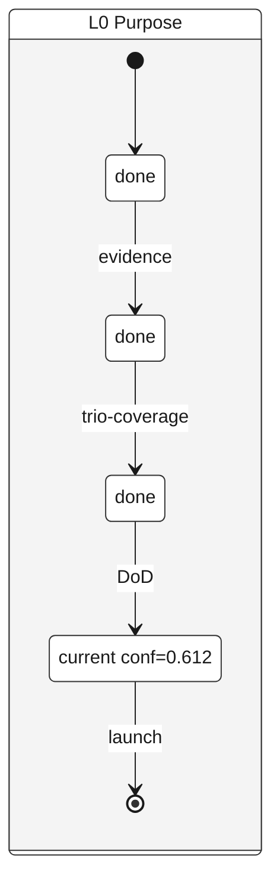

# Diamond Render

Read-only render of `.claude/diamonds/active.yml` as a state diagram. First specialist of the render fleet. Other specialists (`/mycelium:ost-render`, `/mycelium:cycle-render`) and the dispatcher (`/mycelium:render`) ship in subsequent patches.

## When NOT to use

- To advance a diamond (Discover → Define etc.) → `/mycelium:diamond-progress`.
- To score gates against current evidence → `/mycelium:diamond-assess`.
- To start a new diamond → `/mycelium:start`.

## Identifier exposure

**Declared**: NONE

### Scope (canvas surfaces touched)

| Canvas file | Identifier-bearing fields | Frequency |
|---|---|---|
| `.claude/diamonds/active.yml` | none in current schema (v1) | n/a |
| `${CLAUDE_PLUGIN_ROOT}/engine/diamond-rules.md` | none (canonical phase list) | n/a |

### Rationale

`diamonds/active.yml` is phase-state shape: scale (L0–L5), phase (Discover/Define/Develop/Deliver), confidence value, gate-history timestamps. No contributor names, no participant fields, no identifier-bearing prose. Zero identifier exposure as of v0.40.0.

**Future-schema-change caveat**: if a future schema adds an identifier field (e.g., per-team diamond ownership for multi-team Mycelium per the deferred Team Topologies adoption), this declaration becomes false. The skill must then be re-declared `YES` or `MIXED`, consult the registry per `engine/render-conventions.md#hard-rule-consent--privacy-gate`, and ship redaction fixtures. The schema-versioning rule surfaces the schema_version mismatch at runtime as a forcing function for the re-audit.

### Anon-label convention

Not applicable (NONE).

### Worked example

Render of `diamonds/active.yml` with no identifier content present:

```
L0 Purpose: [Discover]→[Define]→[Develop*]→[Deliver]
                                  conf=0.612
```

No identifiers anywhere in the output, regardless of audience.

### Fixture pointer

Not applicable. Check 43 forbids redaction fixtures on NONE-declared specialists (avoids the "declares NONE but acts YES" drift). Other fixtures (see § Test fixtures below) exercise actual behavior.

## Preflight: Read source

1. Read `.claude/diamonds/active.yml` with the Read tool. **Full read** (state diagram needs the full structure; `limit:1` not appropriate here).
2. Read `${CLAUDE_PLUGIN_ROOT}/engine/diamond-rules.md` to get the canonical phase list per scale + the four canonical phase-transition gate names.
3. If `--as-of <date>` was specified, also read `.claude/harness/decision-log.md` to walk backward to that date.
4. Note the source's canvas-state timestamp per `engine/render-conventions.md#canvas-state-timestamp-resolution`: `_meta.last_validated` if present, else top-level `last_updated:`.

## Arguments

| Arg | Default | Values | Effect |
|---|---|---|---|
| `--format` | `mermaid` | `mermaid` \| `ascii` \| `json` | Output format. `markdown-table` and `markdown-list` are NOT supported (state diagrams don't map cleanly); fail loud per `engine/render-conventions.md#format-support-negotiation-global-rule`. |
| `--scale` | `active` | `L0` \| `L1` \| `L2` \| `L3` \| `L4` \| `L5` \| `active` \| `all` | Which diamond(s) to render. `active` = all diamonds with non-null `phase`. |
| `--theme` | `base` | `base` \| `dark` | Theme. `dark` is the WCAG-by-construction opt-in per `engine/render-conventions.md#wcag-aa-theme-convention`. |
| `--show-gates` | `true` | bool | Annotate transitions with phase-transition gate names + theory-gate status block. |
| `--show-confidence` | `true` | bool | Annotate phases with confidence values. |
| `--show-history` | `false` | bool | Include `gate_history` entries as transition timestamps. |
| `--as-of` | `null` | ISO date | Render diamond state as-of this date (walk decision-log backward). Fail loud if date precedes the first decision-log entry mentioning the diamond. |

## Workflow

### Step 1: Resolve scale

- `--scale active` → enumerate diamonds with non-null `phase`. If empty, emit `No active diamond — run /mycelium:start` placeholder + canonical disclaimer + early return.
- `--scale L<N>` → render only that scale; fail loud if scale not present.
- `--scale all` → render every diamond regardless of phase.

### Step 2: Build per-diamond state

For each diamond to render:
- States = the four canonical phases (Discover, Define, Develop, Deliver). Canonicalize on emit: if canvas uses lowercase, render as canonical case. Surface lowercase-canvas as a `canvas-health` follow-up note.
- Current state = `phase` from active.yml (case-insensitive match).
- Completed states = phases before current per linear order.
- Future states = phases after current.
- **Transition labels (phase-transition gates)** if `--show-gates=true`:
  - Discover → Define : `evidence`
  - Define → Develop : `trio-coverage`
  - Develop → Deliver : `DoD`
  - Deliver → [*] : `launch`
- **Theory gate status annotation** if `--show-gates=true` AND `theory_gates_status` field present: emit `note right of <ID>` block summarizing pass/fail/pass-with-risk per gate (evidence/cynefin/bias/bvssh/corrections/four_risks/jtbd).
- Phase annotation = `confidence` field from active.yml (NOT `confidence_threshold`) if `--show-confidence=true`. Display as `conf=<value>`.

### Step 2a: Spawn-relationship arrows (multi-diamond renders)

When rendering multiple diamonds and a child's `parent_id` is set:
- Emit between-state arrow after per-diamond blocks: `<parent_id> --> <child_id> : spawned <YYYY-MM-DD>`.
- Date from child's `created_at` field.
- If `parent_id` is null OR `created_at` missing, skip the arrow.

### Step 3: Staleness check

Per `engine/render-conventions.md#staleness-check-distinction`: compare canvas-state timestamp against the most recent decision-log entry mentioning the diamond's scale. If decision-log activity is newer than canvas timestamp, prepend the staleness warning.

### Step 4: Emit by format

**Format `mermaid` (default)** — Mermaid stateDiagram-v2 with WCAG AA theme.

Use **frontmatter config syntax** per `engine/render-conventions.md#mermaid-frontmatter-syntax-preferred`. `--theme dark` opt-in switches to Mermaid's built-in dark theme.



State IDs in spawn arrows MUST match the `as <ID>` declarations (see Counter-Argument item 3). `classDef current` is required whenever `class ... current` is used (see Counter-Argument item 4). Phase-state IDs use the scale prefix (L0_Discover, L1_Discover etc.) to avoid collision in multi-diamond renders.

**Format `ascii`** — terminal-friendly:

```
L0 Purpose
═══════════════════════════════════════════════
  [Discover]─evidence─▶[Define]─trio─▶[Develop*]─DoD─▶[Deliver]
   done                done              current             upcoming
                                         conf=0.612

* = current phase
```

When `--scale all` or `--scale active` with multiple diamonds, stack diamond blocks vertically with `═` rule separators.

**Format `json`** — external-system integration:

```json
{
  "schema_version": 1,
  "render": "diamond",
  "source": ".claude/diamonds/active.yml",
  "source_last_validated": "<YYYY-MM-DD>",
  "diamonds": [
    {
      "scale": "L0",
      "name": "Purpose",
      "current_phase": "Develop",
      "confidence": 0.612,
      "phases": [
        {"name": "Discover", "status": "done"},
        {"name": "Define", "status": "done"},
        {"name": "Develop", "status": "current"},
        {"name": "Deliver", "status": "upcoming"}
      ],
      "gates": [
        {"from": "Discover", "to": "Define", "name": "evidence"},
        {"from": "Define", "to": "Develop", "name": "trio-coverage"},
        {"from": "Develop", "to": "Deliver", "name": "DoD"}
      ]
    }
  ],
  "dropped_fields": ["gate_history", "decision_log_refs", "phase_completion_notes"]
}
```

### Step 5: Append disclaimers

Per `engine/render-conventions.md`:

- **Lossy-on-export** (mermaid + ascii only): list dropped fields. For diamond-render: `gate_history`, `last_progressed_by`, `decision_log_refs`, prose `phase_completion_notes`.
- **Canonical disclaimer**: final block. `stateDiagram-v2` is stable; no beta warning.
- **mermaidchart.com handoff**: appended for `--format mermaid` only.

## Rules

1. **Read-only.** Never modify active.yml, decision-log, or any state.
2. **Phase name spellings** must match `engine/diamond-rules.md`. Do not abbreviate, paraphrase, or invent variants.
3. **Empty-case behavior**: if active.yml is null/empty or has no diamonds with `phase` set, emit `No active diamond — run /mycelium:start` placeholder + canonical disclaimer. Do NOT error.
4. **Format-unsupported behavior**: if `--format markdown-table` or `--format markdown-list` requested, fail loud per `engine/render-conventions.md#format-support-negotiation-global-rule`. Do NOT silently downgrade.
5. **`--as-of` historical mode**: if the date precedes the first decision-log entry mentioning the diamond, fail loud with `no recorded state at that date`. Do NOT extrapolate.
6. **Never invent** gates, phases, or confidence values not in the canvas or `engine/diamond-rules.md`.

## Counter-Argument Check

Before emitting:

1. *"Is this render's current-phase marker the truth, or has the canvas been edited since the last `/mycelium:diamond-progress` walk?"* The staleness check (Step 3) is the mechanical answer.
2. *"Am I rendering a single diamond when the project is in fractal-of-diamonds mode and all six are load-bearing?"* If `--scale active` and only one diamond has a phase set BUT decision-log mentions phase progression on others, surface: `Other diamonds present in active.yml (<list>) without recorded phase — consider --scale all to render the full state.`
3. *"Are all state IDs referenced in transitions and class lines actually defined?"* Walk every `<src> --> <dst>` arrow and `class <X> <name>` line; verify both sides are either a defined `state ... as <ID>` OR a Mermaid built-in (`[*]`). Mismatch = parse error at render time.
4. *"Is `classDef current` defined if any `class ... current` line is emitted?"* Without `classDef`, the class line is a silent no-op. Emit `classDef current fill:#fff9c4,stroke:#3e2723,color:#3e2723,stroke-width:3px` once at the top when any `class ... current` follows.

## What this skill does NOT do

- Does NOT advance the diamond. That's `/mycelium:diamond-progress`.
- Does NOT score gates against current evidence. That's `/mycelium:diamond-assess`.
- Does NOT explain WHY the diamond is in its phase. That lives in decision-log and the diamond-assess output.
- Does NOT generate the diamond. That's `/mycelium:start`.

This skill is a **read-only snapshot emitter**.

## Recommend-not-invoke from `/mycelium:diamond-assess`

`/mycelium:diamond-assess` ends its Step 5 (decision output) with:

```
> _Visualize the assessed state: run `/mycelium:diamond-render` (defaults
> to L0 active scale). The canvas remains source of truth; this render
> is a snapshot._
```

NOT a silent sub-invocation. User retains one-hop control.

## Test fixtures (G-V12 / Check 37)

- `tests/bash/fixtures/diamond-render/empty-active.yml` → assert placeholder
- `tests/bash/fixtures/diamond-render/single-L0.yml` → assert mermaid stateDiagram-v2 with `class L0_Develop current`
- `tests/bash/fixtures/diamond-render/multi-scale.yml` → assert two state blocks emitted with spawn arrow
- `tests/bash/fixtures/diamond-render/stale-canvas.yml` → assert staleness warning in output
- `tests/bash/fixtures/diamond-render/unsupported-format.yml` → assert fail-loud message
- `tests/bash/fixtures/diamond-render/as-of-historical.yml` → assert decision-log walk
- `tests/bash/fixtures/diamond-render/as-of-before-history.yml` → assert fail-loud on out-of-range date

## Theory citations

- Mycelium diamond engine (Discover/Define/Develop/Deliver fractal at six scales L0–L5)
- Argyris triple-loop (the diamond renders the loop currently in motion)
- Hick's Law (single recommended format default; explicit fail-loud on unsupported)
- WCAG 2.1 AA (contrast bar for human-audience rendering; `engine/render-conventions.md#wcag-aa-theme-convention`)
