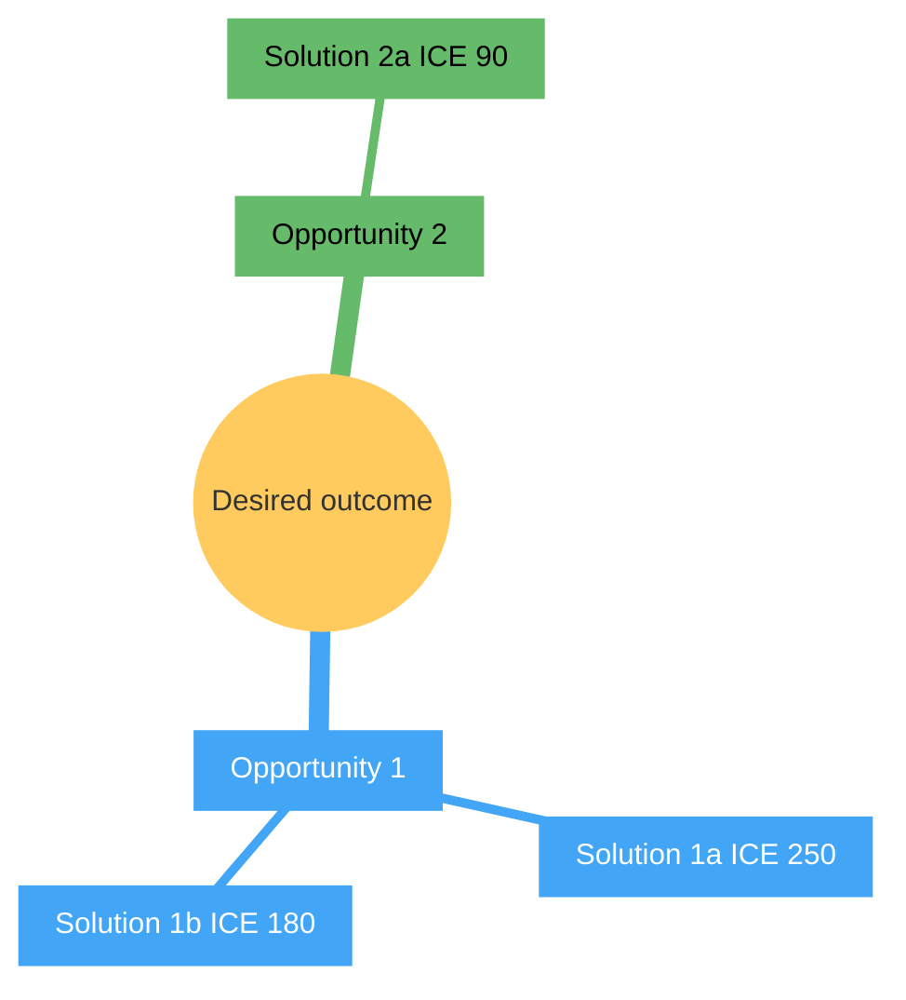

# OST Render

Read-only render of `.claude/canvas/opportunities.yml` as a diagram or structured list. Second specialist in the render fleet (after `/mycelium:diamond-render`). See `${CLAUDE_PLUGIN_ROOT}/engine/render-conventions.md` for shared conventions.

## When NOT to use

- To BUILD or update the OST from research data → `/mycelium:ost-builder`. This skill is read-only.
- For cross-cutting opportunity→solution→cycle traceability view → dispatcher's `/mycelium:render --view traceability` (deferred to Phase 4a–4d research-first methodology per architecture draft §10.2).
- For ICE scoring of solutions → `/mycelium:ice-score`.

## Identifier exposure

**Declared**: YES

### Scope (canvas surfaces touched)

| Canvas file | Identifier-bearing fields | Frequency |
|---|---|---|
| `.claude/canvas/opportunities.yml` | `evidence_sources` (URL-or-name strings); `notes` prose | low (~1 in 10 cites a named individual rather than a URL) |
| `$MYCELIUM_ATTRIBUTION_REGISTRY` env var (canonical) or `.claude/memory/attribution-registry.yml` (fallback) | `people:` block with `name`+`consent`+`note` per entry | read-only consultation; never rendered |

Per `${CLAUDE_PLUGIN_ROOT}/engine/render-conventions.md#hard-rule-consent--privacy-gate`. Registry lives in roadmap-private memory by design — upstream Mycelium repo is public; registry contents must not ship there.

### Rationale

OST shape is user-need-shaped (abstract opportunities and solutions), so identifier exposure is incidental rather than intrinsic. Identifier classes that can appear: cohort testers, peer practitioners, named external sources. All three go through the consent gate; external sources are typically `public_ok` already, but registry consultation is non-skippable to avoid drift.

### Anon-label convention

Per `engine/render-conventions.md#anon-label-convention`:
- Cohort tester → `cohort-tester-N`
- Peer practitioner → `peer-practitioner-N`
- Unknown identifier class → `participant-N`

Numbering resets per render; emit an in-render mapping footnote when redaction occurred so the operator can audit which anon label maps to which registry entry.

### Consent value semantics

Per `engine/render-conventions.md#consent-value-semantics`:

| Value | Render behavior |
|---|---|
| `public_ok` | Render literal. Append carve-out footnote pointer if entry has non-empty `note:`. |
| `generic_only` | Redact to anon-label. Queue anon-mapping footnote. |
| `unknown` | Treat as `generic_only` per registry README. |
| (not in registry) | Fail loud unless `--no-identifiers=true`. |

### Worked examples

**public_ok → literal**: `evidence_sources: ["Drew Hoskins LinkedIn 2026-05-11"]`, registry entry `{name: "Drew", consent: public_ok, note: "..."}` → renders as `Drew Hoskins LinkedIn 2026-05-11` + carve-out footnote pointer.

**generic_only → anon-label**: `evidence_sources: ["Daniel Bentes install report"]`, registry entry `{name: "Daniel", consent: generic_only, ...}` → renders as `peer-practitioner-1 install report` + anon-mapping footnote.

**Already-anon canvas label → preserve**: `evidence_sources: ["cohort-tester-3 session 2 transcript"]`, canvas already anon-labeled → renders as `cohort-tester-3 session 2 transcript` (preserve canvas-side anonymization; do not look up).

**Identifier absent from registry → fail loud**: `evidence_sources: ["Random Name DM 2026-06-05"]`, no entry → emit fail-loud with three fix options (add to registry, re-run with `--no-identifiers`, edit canvas).

### Fixture pointer

- `tests/bash/fixtures/ost-render/redaction-public-ok-literal.yml`
- `tests/bash/fixtures/ost-render/redaction-generic-only-anon.yml`
- `tests/bash/fixtures/ost-render/redaction-unknown-treated-as-generic.yml`
- `tests/bash/fixtures/ost-render/redaction-no-registry-entry-fail-loud.yml`
- `tests/bash/fixtures/ost-render/redaction-carve-out-note-footnote.yml`

## Preflight: Read sources

1. Read `.claude/canvas/opportunities.yml` with the Read tool. Full read for emit; not `limit:1`.
2. Read the attribution registry per path-resolution order in `engine/render-conventions.md#registry-path-resolution`: `$MYCELIUM_ATTRIBUTION_REGISTRY` env var first; fall back to `.claude/memory/attribution-registry.yml`. Registry root key is `people:`; each entry has `name`, `consent`, optional `note`. If registry absent, surface `⚠ no attribution-registry — consent-redaction not enforceable; treat output as roadmap-internal` warning in the render header.
3. Note the source's canvas-state timestamp per `engine/render-conventions.md#canvas-state-timestamp-resolution`: `_meta.last_validated` if present, else top-level `last_updated:`.

## Arguments

| Arg | Default | Values | Effect |
|---|---|---|---|
| `--format` | `mermaid` | `mermaid` \| `ascii` \| `markdown-list` \| `json` | Output format. `markdown-table` is NOT supported (trees don't map to tables); fail loud per `engine/render-conventions.md#format-support-negotiation-global-rule`. |
| `--shape` | `mindmap` | `mindmap` \| `flowchart-td` | Mermaid diagram shape. `flowchart-td` opt-in for users who prefer directed-graph rendering or whose target renderer doesn't honor mindmap palette. |
| `--theme` | `base` | `base` \| `dark` | Theme. `dark` is the WCAG-by-construction opt-in per `engine/render-conventions.md#wcag-aa-theme-convention`. |
| `--root-outcome` | `null` | opportunity ID | Render sub-tree rooted at this opportunity. Fail loud if ID does not exist. |
| `--include-status` | `all` | `active` \| `archived` \| `closed` \| `resolved` \| `all` | Filter by lifecycle state. |
| `--show-ice` | `true` | bool | Suffix ICE score on solution nodes (drop if zero). |
| `--show-confidence` | `false` | bool | Suffix confidence on solution nodes. |
| `--no-identifiers` | `false` | bool | Force all name references to redact to anon-labels regardless of consent state. |

## Workflow

### Step 1: Parse + filter

Read opportunities.yml. Build in-memory tree:
- Root = `desired_outcome` (top-level field).
- Branches = top-level opportunities.
- Leaves = solutions per opportunity.
- Apply `--include-status` filter (drop entries that don't match).
- If `--root-outcome <id>`, prune tree to subtree rooted at the given ID; fail loud if ID absent.

### Step 2: Consent check on identifier-bearing fields

Per `engine/render-conventions.md#hard-rule-consent--privacy-gate`. For every `evidence_sources` entry AND every named-individual mention in `notes` prose:
- Skip URL-shaped entries (`http://`, `https://`).
- Skip file-path-shaped entries (`*.yml#...`, `../*`, `.claude/*`).
- Skip already-anon canvas labels (`cohort-tester-N`, `peer-practitioner-N`, `participant-N` patterns).
- For name-shaped remaining entries: look up first-name token in the registry's `people:` block.
- Apply consent value semantics per the table above.
- Maintain consistent anon-label numbering across the render (same registry entry → same N).

### Step 3: Apply suffixes + escape

- ICE suffix if `--show-ice=true` and ICE present.
- Confidence suffix if `--show-confidence=true`.
- Escape labels per `engine/render-conventions.md#mermaid-label-escape-rules`.

### Step 4: Emit by format

**Format `mermaid` (default)** — Mermaid mindmap with WCAG AA theme.

Use **frontmatter config syntax** per `engine/render-conventions.md#mermaid-frontmatter-syntax-preferred`. Default uses Material Design palette (verified-working across mermaid.live, mermaidchart.com, Obsidian). `--theme dark` opt-in switches to Mermaid's built-in dark theme. `--shape flowchart-td` opt-in switches to directed-graph rendering for renderers that don't honor mindmap palette overrides.



**Critical**: `cScale0`/`cScaleLabel0` are wasted (off-by-one in mindmap source: section indexing starts at `cScale1`). Setting them is harmless belt-and-suspenders. `cScale1` is the first rendered section's color.

**Format `ascii`** — terminal-friendly tree:

```
Desired outcome
├── opp-001: Opportunity 1
│   ├── sol-001a: Solution 1a (ICE 250)
│   └── sol-001b: Solution 1b (ICE 180)
└── opp-002: Opportunity 2
    └── sol-002a: Solution 2a (ICE 90)
```

**Format `markdown-list`** — hierarchical list:

```
- Desired outcome
  - opp-001: Opportunity 1
    - sol-001a: Solution 1a (ICE 250)
    - sol-001b: Solution 1b (ICE 180)
  - opp-002: Opportunity 2
    - sol-002a: Solution 2a (ICE 90)
```

**Format `json`** — external-system integration:

```json
{
  "schema_version": 1,
  "render": "ost",
  "source": ".claude/canvas/opportunities.yml",
  "source_last_validated": "<YYYY-MM-DD>",
  "tree": {
    "outcome": "Desired outcome",
    "opportunities": [
      {
        "id": "opp-001",
        "title": "Opportunity 1",
        "status": "active",
        "solutions": [
          {"id": "sol-001a", "title": "Solution 1a", "ice": 250, "confidence": null}
        ]
      }
    ]
  },
  "redactions_applied": [],
  "dropped_fields": ["four_risks", "evidence_sources", "assumption_tests", "notes", "decision_log_refs"]
}
```

### Step 5: Append disclaimers

Per `engine/render-conventions.md`:

- **Lossy-on-export** (mermaid + ascii + markdown-list): list fields dropped. For ost-render: `four_risks`, `evidence_sources`, `assumption_tests`, prose `notes`, `decision_log_refs`.
- **Redaction footnote** if any anon-labels emitted: list anon-label → registry-entry mapping for audit.
- **Carve-out footnote pointers** for any literal name whose registry entry has non-empty `note:`.
- **Canonical disclaimer**: final block.
- **mermaidchart.com handoff** for `--format mermaid` only.

## Rules

1. **Read-only.** Never modify opportunities.yml or any state.
2. **If `--root-outcome <id>` does not exist** in opportunities.yml, fail loud; do NOT silently render the full tree.
3. **If opportunities.yml is empty**, emit a placeholder mindmap with `No opportunities yet — run /mycelium:ost-builder` + canonical disclaimer. Don't error.
4. **Never invent** opportunities or solutions not in the canvas.
5. **Consent gate is non-skippable.** Identifier-bearing fields go through Step 2 regardless of `--format`. The only override is `--no-identifiers=true`.

## Counter-Argument Check

Before emitting:

1. *"Am I rendering opportunities that are archived but still load-bearing in current strategy, or treating archived as deleted?"* Default `--include-status=all` to avoid silent-omission bias.
2. *"Did I consult the attribution-registry for EVERY name-shaped identifier in evidence_sources and notes, not just the obvious ones?"* The fraud risk is in prose names that look like URLs. Bias toward registry consultation when ambiguous.
3. *"Did I confirm `cScale*` palette is set per `engine/render-conventions.md#verified-working-palette`?"* The mindmap default palette uses rotating bright colors with white text and fails WCAG AA. The verified-working palette is the required default for `theme: base`.

## What this skill does NOT do

- Does NOT build the OST. That's `/mycelium:ost-builder`.
- Does NOT score solutions. That's `/mycelium:ice-score`.
- Does NOT cross-cut to cycles or solutions launched. That's the dispatcher's `--view traceability` (deferred Phase 4a–4d).

## Test fixtures (G-V12 / Check 37)

- `tests/bash/fixtures/ost-render/empty-canvas.yml` → assert placeholder + pointer to `/mycelium:ost-builder`
- `tests/bash/fixtures/ost-render/single-opp-single-sol.yml` → assert mindmap with one branch
- `tests/bash/fixtures/ost-render/multi-opp-archived-filter.yml` → assert `--include-status=active` excludes archived branches
- `tests/bash/fixtures/ost-render/root-outcome-subtree.yml` → assert `--root-outcome opp-002` renders only that subtree
- `tests/bash/fixtures/ost-render/missing-root-outcome.yml` → assert fail-loud
- `tests/bash/fixtures/ost-render/redaction-public-ok-literal.yml` → assert public_ok name renders literally
- `tests/bash/fixtures/ost-render/redaction-generic-only-anon.yml` → assert generic_only name redacts to anon-label
- `tests/bash/fixtures/ost-render/redaction-no-registry-entry-fail-loud.yml` → assert fail-loud when name absent from registry
- `tests/bash/fixtures/ost-render/all-formats.yml` → assert mermaid, ascii, markdown-list, json all emit valid output

## Theory citations

- Torres (OST shape, evidence-only)
- Hick's Law (single recommended format default; explicit fail-loud on unsupported)
- WCAG 2.1 AA (mindmap palette per `engine/render-conventions.md#wcag-aa-theme-convention`)
